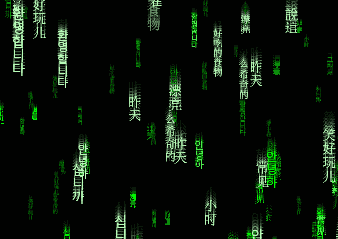
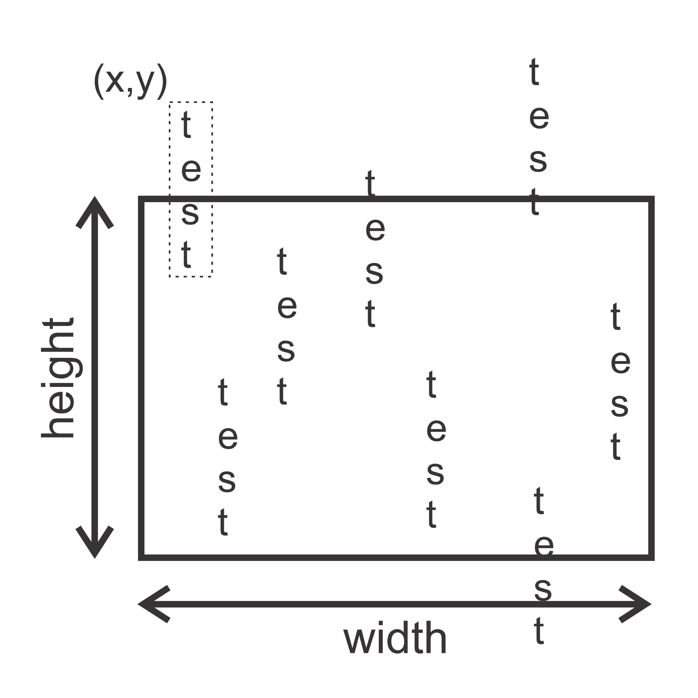
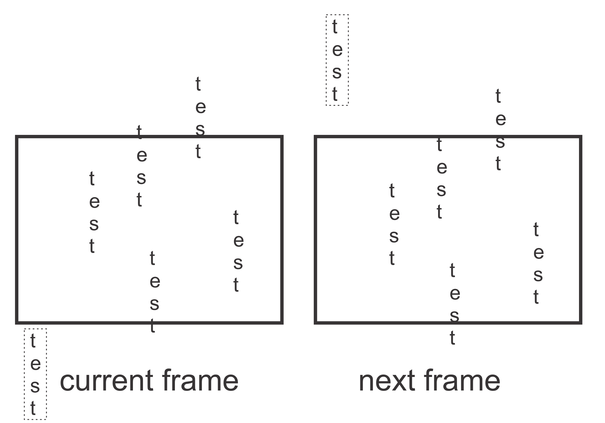
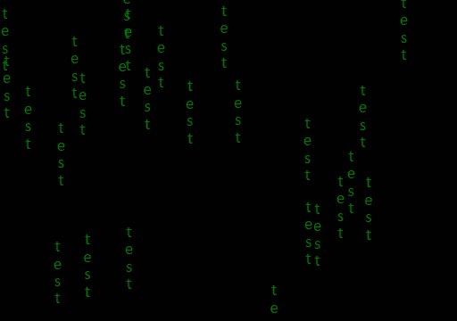

This is how the end result will looks like:



<a href="https://jsfiddle.net/welcometors/tz38d5vg/1/" target="_blank">Click here to see live demo with code</a>

First we need to create an HTML5 canvas. A HTML5 canvas is used to draw graphics. Almost all of the flash graphics are pretty much replaced by canvas today.

```HTML
<canvas id="background" width="512" height="360">
</canvas>
```

This will be served as an output screen for our animation.

Now, we can access the canvas in javascript:

```javascript
var canvas = document.getElementById('background');
var context = canvas.getContext('2d');
```

__Canvas__ object contains the properties related to output window like width, height etc.
__Context__ object will be used to call in-built functions for drawing, writing etc.

Let us assume that our text string is "test", which is falling vertically in our output screen.
Also, we need multiple instances of it.  
Let us assume that the coordinates of the top left corner of a text instance is _x_ and _y_.
See below:



I encapsulated one of them in a dotted box to showcase the top right coner of a single instance.
Since, we don't have infinite memory for our infinitely falling matrix text instances. So we need to reuse them.
A clever trick is to change the coordinate back to the top when they cross the bottom of the screen.



This way, we only need few instances to make our screen look full. 
To avoid them form keep falling in the same column we can re-randomize _x_ while changing _y_ to top.  

If you have worked with any graphics library in the past then you will be familiar with the coordinate system of canvas. 
Top left corner will be _(0,0)_ and _x_ will increase as you go right and _y_ will increase as you go down. 
We'll be moving our text in range _(x,-screenHeight)_ to _(x,+screenHeight)_ for some randomized _x_.

For moving text we are creating a class (called Bit) to manage them as an individual objects.

```javascript
function Bit (){
    // x and y positions are initialized randomly
    this.xpos = Math.random() * canvas.width;
    this.ypos = Math.random() * 2 * canvas.height - canvas.height;

    // this draw the text for current frame
    this.draw = function(){
        // Formatting the text to display
        context.fillStyle = 'green';
        context.font = '14pt Calibri';

        var text = "test";
        var textWidth = context.measureText("W.").width;

        // we need to draw the characters of the text
        // one by one from top to bottom
        for(var i=0; i<text.length; i++){
            var charaterWidth = context.measureText(text[i]).width;
            context.fillText( text[i], 
                this.xpos - charaterWidth/2, 
                this.ypos + i*textWidth);
        }
    };
    
    // this will update the text for next frame
    this.tick = function(){
        if(this.ypos > canvas.height){
            // if text crosses the bottom of the screen then reset 
            this.ypos = -canvas.height;
            this.xpos = Math.random() * canvas.width;
        }
        else
            this.ypos += 2; // drop text by 2 pixels down
    };
}
```

For testing, we'll create some of the __Bit__ objects:
```javascript
var bits = new Array();
for(var i = 0; i < 50; ++i)
    bits.push(new Bit());
```

Now, we need a function to redraw at every frame.
```javascript
function reDraw(){
    // before drawing clear entire screen
    context.fillStyle = 'black';
    context.fillRect(0, 0, canvas.width, canvas.height);

    // draw every text elements
    for(var bit in bits){
        bits[bit].draw();
        bits[bit].tick();
    }
}

// This will call 'reDraw' at every 33 milliseconds. 
// So, our animation will run at 30fps (1000/33 ≈ 30).
setInterval(reDraw, 33);
```

Now, our code will run like this:



<a href="https://jsfiddle.net/welcometors/tz38d5vg/0/" target="_blank">Click here to see live demo with code</a>

Make sure you understood above code completely before moving ahead.
* * *

Now, we need to add depth (i.e. some text are near and some are far) in our falling matrix. 
This can be achieved by changing the text size, falling speed and brightness according to the depth.

We need different colors and bunch of randomized symbols:
```javascript
var colors = ['#008800', '#00FF00', '#55FF55', '#BBFFBB'];
var words = [
    "昨天", "小时", "钟表", "漂亮", "常见", "說這",
    "안녕하", "그래서", "안녕하", "십니까", "洗手在",
    "笑好玩儿", "么希奇的", "환영합니다", "好吃的食物"];
```

We need to change our **Bit** class for depth (distance).

```javascript
function Bit (distance){
    // size and speed are inversely proportional to distance
    this.speed = 160 / distance;
    this.fontSize = parseInt(Math.max(8, Math.min(4*this.speed, 20)));
    
    // font and color will be decided accordingly
    this.font = this.fontSize.toString() +'pt Calibri';
    this.color = colors[(this.fontSize-8)/4];
    
    this.xpos = Math.random() * canvas.width;
    this.ypos = Math.random() * 2 * canvas.height - canvas.height;
    this.text = Math.floor(Math.random() * words.length);

    this.draw = function(){
        context.fillStyle = this.color;
        context.font = this.font;
        
        var text = words[this.text];
        var textWidth = context.measureText("W.").width;

        for(var i=0; i<text.length; i++){
            var charaterWidth = context.measureText(text[i]).width;
            context.fillText( text[i], 
                this.xpos - charaterWidth/2, 
                this.ypos + i*textWidth);
        }
    };
    
    this.tick = function(){
        if(this.ypos > canvas.height){
            this.ypos = - canvas.height;
            this.xpos = Math.random() * canvas.width;
            this.text = Math.floor(Math.random() * words.length);
        }
        else
            this.ypos += this.speed;
        
        // we will give 2% change to change the text
        var chance = Math.random();
        if( chance < .01) // change to next word
            this.text = (this.text + 1) % words.length;
        else if( chance < .02) // change to previous word
            this.text = (this.text - 1 + words.length) % words.length;
    };
}
```

For the motion blur effect we just need to change one line in the _redraw()_
```javascript
context.fillStyle = 'rgba(0,0,0,0.4)';
```
Instead of putting an opaque black rectangle, we can put a transparent one. 
As a result, previous frame will slowly fade away, frame by frame, instead of disappearing at once. 
And on screen, it’ll look like text is leaving a trail behind. Which will serve as our fake motion blur.

We can also change the canvas size programmatically to adapt to the window size.
```javascript
context.canvas.width  = window.innerWidth;
context.canvas.height = window.innerHeight;
```

Final results:


<a href="https://jsfiddle.net/welcometors/tz38d5vg/1/" target="_blank">Click here to see live demo with code</a>