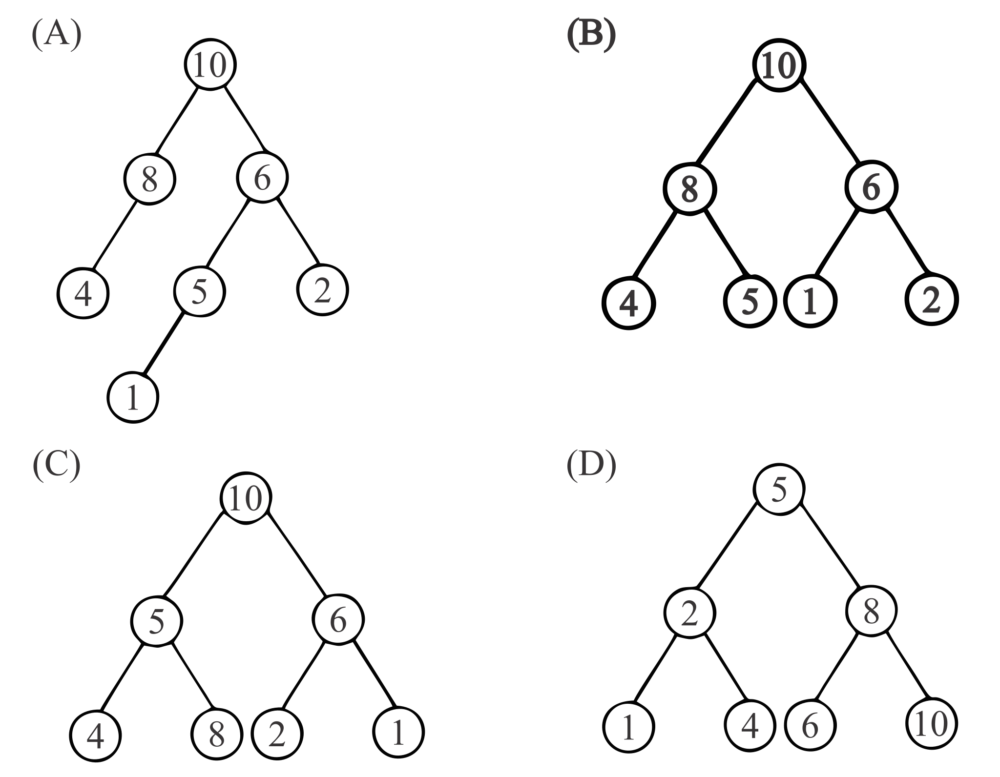
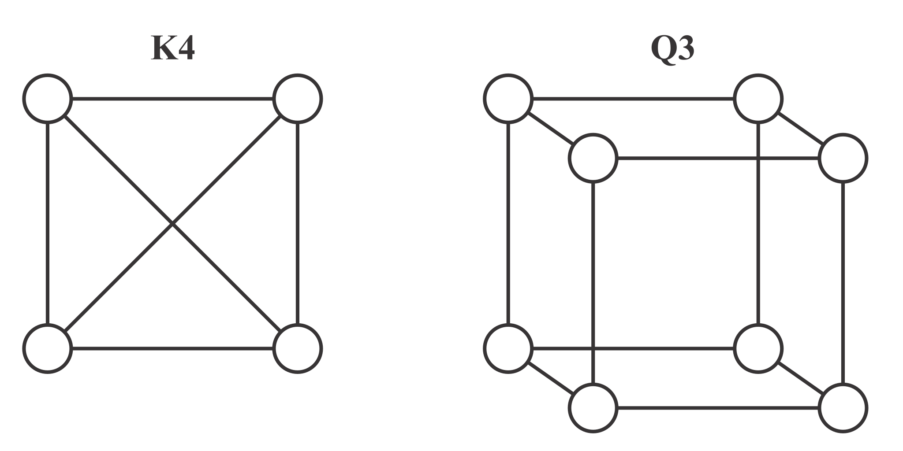
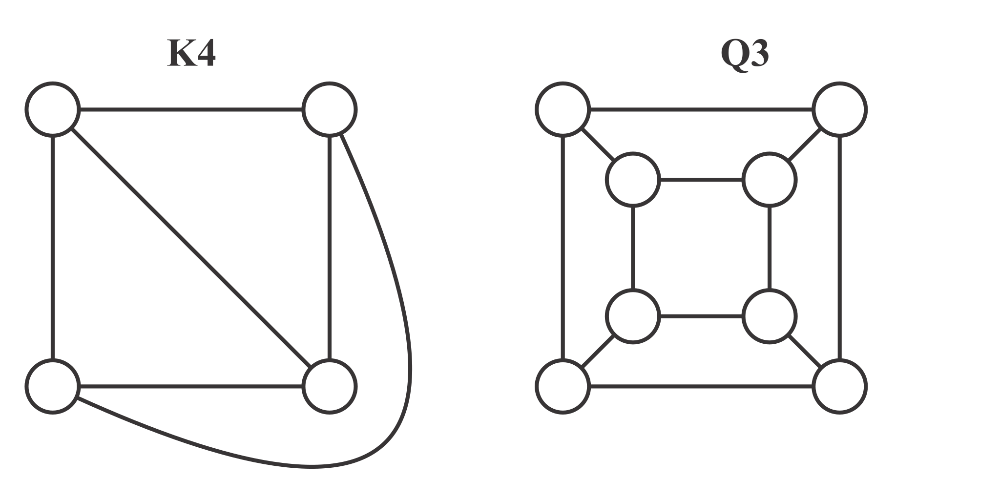
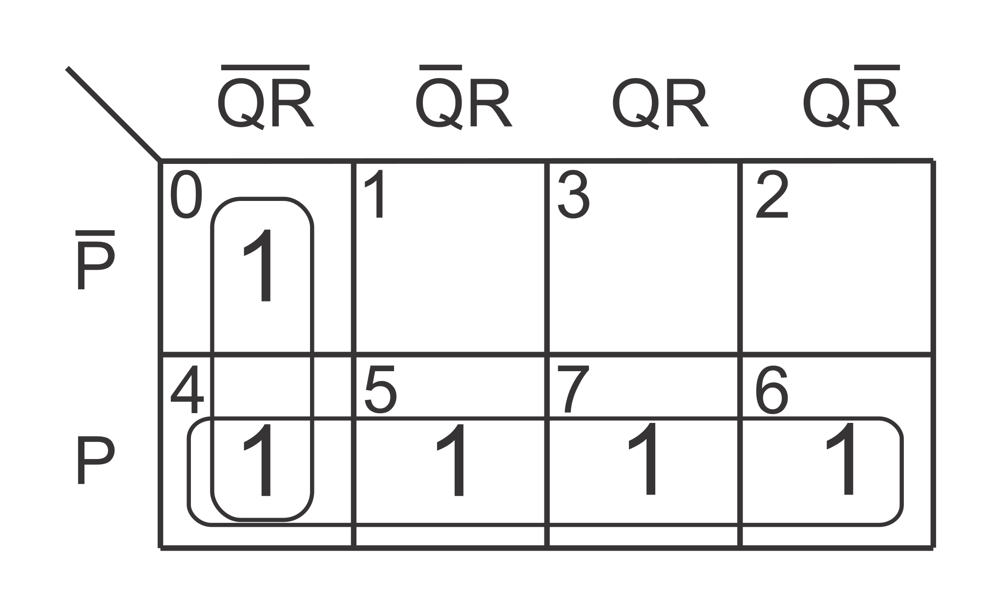
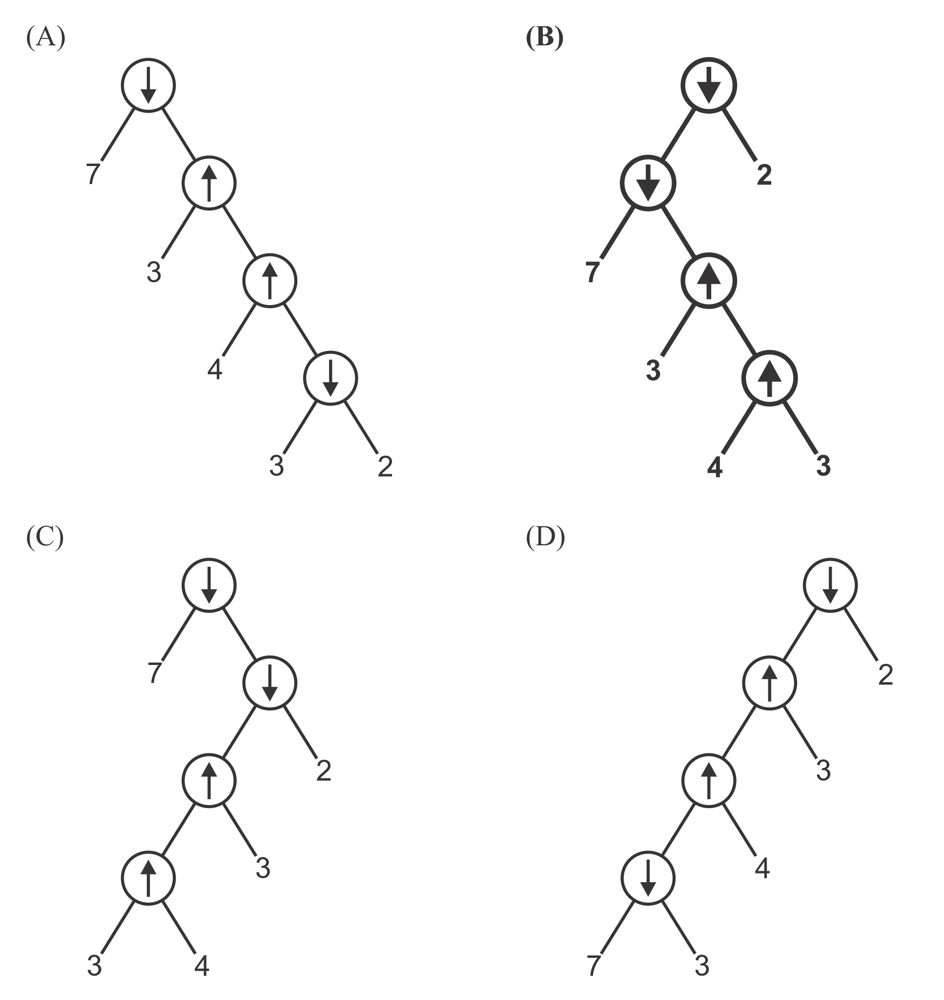

What I've seen from the 2011 and past papers is that almost all of the questions were from the standard books. 
I studied all subjects from the standard books while doing B.Tech. courses.
And, for practice, I've used past papers from 2003-10. 
That's all I've done for my GATE preparation. 
I haven't joined any coaching or online test series for GATE.

Mathematics questions were mostly new and fresh. Also, you can never escape maths in computer science.
So, you should have a strong mathematical base (especially Probability), if not then start with that.

If you have enough time along with preparation then spend your time on programming. 
<a href="https://www.hackerrank.com" target="_blank">Hackerrank</a> is a very good site for that. 
You can challenge your programming skills along with mathematical skills on 
<a href="https://projecteuler.net" target="_blank">Projecteuler</a>. 

List of some standard books:
* Discrete mathematics: Kenneth H Rosen
* Digital Logic: Morris Mano
* Data Structure: Ellis Horowitz or Kruse (Kruse is easier with better examples)
* Algorithms: Coreman (you don't need anything else)
* Automata/TOC: Ullman (you don't need anything else)
* Compiler: Ullman
* Computer Networks: Frouzan (some topics are cleaner in Tanenbaum)
* Operating Systems: Galvin
* Database: Korth (Navathe for B and B+ Trees)
* Computer Organization/Architecture: Hamacher + Morris Mano (both have their strengths and weakness)

---

<h2 id="index"><b>Questions: Index </b> (Set-C ordering)</h2>

* Q.1 - Q.25 (1 mark questions)
<p class="stackHorizontally5em">
<a href="#q1">Q1</a>
<a href="#q2">Q2</a>
<a href="#q3">Q3</a>
<a href="#q4">Q4</a>
<a href="#q5">Q5</a>
<a href="#q6">Q6</a>
<a href="#q7">Q7</a>
<a href="#q8">Q8</a>
<a href="#q9">Q9</a>
<a href="#q10">Q10</a>
<a href="#q11">Q11</a>
<a href="#q12">Q12</a>
<a href="#q13">Q13</a>
<a href="#q14">Q14</a>
<a href="#q15">Q15</a>
<a href="#q16">Q16</a>
<a href="#q17">Q17</a>
<a href="#q18">Q18</a>
<a href="#q19">Q19</a>
<a href="#q20">Q20</a>
<a href="#q21">Q21</a>
<a href="#q22">Q22</a>
<a href="#q23">Q23</a>
<a href="#q24">Q24</a>
<a href="#q25">Q25</a>
</p>

* Q.26 - Q.45 (2 marks questions)
<p class="stackHorizontally5em">
<a href="#q26">Q26</a>
<a href="#q27">Q27</a>
<a href="#q28">Q28</a>
<a href="#q29">Q29</a>
<a href="#q30">Q30</a>
<a href="#q31">Q31</a>
<a href="#q32">Q32</a>
<a href="#q33">Q33</a>
<a href="#q34">Q34</a>
<a href="#q35">Q35</a>
<a href="#q36">Q36</a>
<a href="#q37">Q37</a>
<a href="#q38">Q38</a>
<a href="#q39">Q39</a>
<a href="#q40">Q40</a>
<a href="#q41">Q41</a>
<a href="#q42">Q42</a>
<a href="#q43">Q43</a>
<a href="#q44">Q44</a>
<a href="#q45">Q45</a>
</p>

---

### Q.1 - Q.25 (1 mark questions)

--------------------------------------------------------------------------------

<h3 id="q1"><b>Question 1</b></h3>

Consider a relational table with a single record for each registered student with the following attributes.
1.  Registration_Num: Unique registration number of each registered student
2.  UID: Unique identity number, unique at the national level for each citizen
3.  BankAccount_Num: Unique account number at the bank. A student can have multiple accounts or join accounts. This attribute stores the primary account number.
4.  Name: Name of the student
5.  Hostel_Room: Room number of the hostel

Which one of the following option is **INCORRECT**?

1. **BankAccount_Num is candidate key**
2. Registration_Num can be a primary key
3. UID is candidate key if all students are from the same country
4. If S is a superkey such that $S \cap \mathit{UID} = \emptyset$ then $S \cup \mathit{UID}$ is also a superkey

### Explanation:

> "X is the candidate key of a relation R only if X→Y where Y is all subsets of R"
>
> -- <cite>Navathe (Fundamentals of DBMS)</cite>

But it neither satisfies BankAccount_Num→UID nor BankAccount_Num→Registration_Num

[↑ Index](#index)

--------------------------------------------------------------------------------

<h3 id="q2"><b>Question 2</b></h3>

A computer handles several interrupt sources of which the following are relevant for this question.
*  Interrupt from CPU temperature sensor (raises interrupt if CPU temperature is too high)
*  Interrupt from Mouse (raises interrupt if mouse is moved or button is pressed)
*  Interrupt from Keyboard (raises interrupt when a key is pressed or released)
*  Interrupt from Hard Disk (raises interrupt when a disk read is completed)

Which one of these will be handled at **HIGHEST** priority?

1. Interrupt from Hard Disk
2. Interrupt from Mouse
3. Interrupt from Keyboard
4. **Interrupt from CPU temperature sensor**
</ol>

### Explanation:

> "Higher priority interrupt levels are assigned to requests which, if delayed or interrupted, could have serious consequences. Devices with high speed transfer such as magnetic disks are given high priority, and slow devices such as keyboard receive low priority."
>
> -- <cite>Morris Mano (Computer System Architecture)</cite>

We know that mouse pointer movements are more frequent than keyboard ticks. So its obvious that its data transfer rate is higher than keyboard.
Delaying a CPU temperature sensor could have serious consequences, overheat can damage CPU circuitry.
From the above information we can conclude that priorities are:

    CPU temperature sensor > Hard Disk > Mouse > Keyboard

[↑ Index](#index)

--------------------------------------------------------------------------------

<h3 id="q3"><b>Question 3</b></h3>

Which of the following is **NOT** desired in a good Software Requirement Specifications (SRS) document?

1. Functional Requirements
2. Non-Functional Requirements
3. Goals of Implementation
4. **Algorithms for Software Implementation**

### Explanation:

> "An SRS document should clearly document the following aspects of a system: Functional Requirements, Non-Functional Requirements and Goals of implementation."
>
> -- <cite>Rajib Mall (Fundamentals of Software Engineering)</cite>

[↑ Index](#index)

--------------------------------------------------------------------------------

<h3 id="q4"><b>Question 4</b></h3>

HTML (HyperText Markup Language) has language elements which permit certain actions other than describing the structure of the web document. Which one of the following actions is **NOT** supported by pure HTML (without any server or client side scripting) pages?

1. Embed web objects from different sites into the same page
2. Refresh the page automatically after a specified interval
3. Automatic redirect to another page upon download
4. **Display the client time as the part of the page**

### Explanation:

* &lt;OBJECT&gt; ... tag is used to embed object
* &lt;META HTTP-EQUIV = &quot;Refresh&quot; CONTENT = &quot;5&quot;&gt; is used to refresh page after every 5 seconds
* &lt;META HTTP-EQUIV = &quot;Refresh&quot; CONTENT = &quot;0&quot; URL = &quot;another-page.html&quot;&gt; is used to redirect

[↑ Index](#index)

--------------------------------------------------------------------------------

<h3 id="q5"><b>Question 5</b></h3>

Which of the following pairs have **DIFFERENT** expressive power?

1. Deterministic Finite Automata (DFA) and Non-Deterministic Finite Automata (NFA)
2. **Deterministic push down automata (DPDA) and Non-Deterministic push down automata (NPDA)**
3. Deterministic single-tape Turing machine and Non-Deterministic single-tape Turing machine
4. Single-tape Turing machine and Multi-tape Turing machine

### Explanation:

> "A language L is accepted by some DFA if and only if L is accepted by some NFA."
>
> "If M<sub>N</sub> is a nondeterministic turing machine, then there is a deterministic turing machine M<sub>D</sub> suchthat L(M<sub>N</sub>) = L(M<sub>D</sub>)"
>
> "Every language is accepted by multitape turing machine is recursively enumerable."
>
> -- <cite>Ullman (Automata theory, languages and computations)</cite>

[↑ Index](#index)

--------------------------------------------------------------------------------

<h3 id="q6"><b>Question 6</b></h3>

A company needs to develop digital signal processing software for one of its newest inventions. The software is expected to have 40000 lines of code. The company needs to determine the effort in person-months needed to develop this software using the basic COCOMO model. The multiplicative factor for this model is given as 2.8 for this software development on embedded systems, while the exponentiation factor is given as 1.20. What is the estimation effort in person-months?

1. **234.25**
2. 932.50
3. 287.80
4. 122.40

### Explanation:

> &quot; $\mathit{Effort} = a_1 . \text{KLOC}^{a_2}$ &quot;
>
> -- <cite>Rajib Mall (Fundamentals of Software Engineering)</cite>

$$ \mathit{KLOC} = \mathit{LOC}/1000 = 40000/1000 = 40 $$

$$ \mathit{Effort} = 2.8 \times {40}^{1.2} = 234.2 $$

[↑ Index](#index)

--------------------------------------------------------------------------------

<h3 id="q7"><b>Question 7</b></h3>

Let the time taken to switch between user and kernel modes of execution be t1 while the time taken to switch between two processes be t2. Which of the following is **TRUE**?

1. t1 > t2
2. t1 = t2
3. **t1 < t2**
4. nothing can be said about the relationship between t1 and t2

### Explanation:

> "Whenever a trap or interrupt occurs, the hardware switches from user mode to monitor mode (this is, changes the state of the mode bit to 0). Thus whenever the operating system gains control of the computer, it is in monitor mode. The system always switches to user mode (by setting the mode bit to 1) before passing the control to a user program."
>
> "When a context switch occurs, the kernel saves the context of old process in its PCB and loads the saved context of the new process scheduled to run."
>
> -- <cite>Galvin (Operating System Concepts)</cite>

As mode switching is a part of context switching, it's definitely less than context switch time. Alternatively, whenever context switch occurs between two user processes then there are two mode changes first from user to monitor and after that monitor to user.

[↑ Index](#index)

--------------------------------------------------------------------------------

<h3 id="q8"><b>Question 8</b></h3>

A company needs to develop a strategy for software product development for which it has a choice of two programming languages L1 and L2. The number of lines of code (LOC) developed using L2 is estimated to be twice the LOC developed with L1. The product will have to be maintained for five years. Various parameters for the company are given in the table below.

| Parameter                                  | Language L1 | Language L2 |
|:-------------------------------------------|------------:|------------:|
| Man years needed for development           |  LOC/10,000 |  LOC/10,000 |
| Development cost per man year              | ₹ 10,00,000 |  ₹ 7,50,000 |
| Maintenance time                           |     5 years |     5 years |
| Cost of maintenance per year               |  ₹ 1,00,000 |    ₹ 50,000 |

Total cost of the project includes the cost of development and maintenance. What is the LOC for L1 for which the total cost of the project using L1 is equal to the cost of project using L2?

1. 4000
2. **5000**
3. 4333
4. 4667

### Explanation:

Let LOC of $L1 = x$, so LOC of $L2 = 2x$

$$Cost(L1) = \frac{x}{10000} \times 1000000 + 5 \times 100000 $$

$$Cost(L2) = \frac{2x}{10000} \times 750000 + 5 \times 50000 $$

$$ 100 x + 500000 = 150 x + 250000 $$

Hence, $ x = 5000 $

[↑ Index](#index)

--------------------------------------------------------------------------------

<h3 id="q9"><b>Question 9</b></h3>

Consider the following activities related to email.
* m1: Send an email from mailbox server to a mail client
* m2: Download an email from mailbox server to a mail client
* m3: Checking email in a web browser

Which application level protocol used in each activity?

1. m1:HTTP &nbsp;&nbsp; m2:SMTP &nbsp;&nbsp; m3:POP
2. m1:SMTP &nbsp;&nbsp; m2:FTP  &nbsp;&nbsp; m3:HTTP
3. **m1:SMTP &nbsp;&nbsp; m2:POP  &nbsp;&nbsp; m3:HTTP**
4. m1:POP  &nbsp;&nbsp; m2:SMTP &nbsp;&nbsp; m3:IMAP

### Explanation:

> "SMTP is a push protocol; it pushes the message from the client to server"
>
> "POP and IMAP supports pull protocol they can pull the message from the server"
>
> "Web-Based mail: Mail transfer from Alice's browser to her mail server is done through HTTP. The message from the receiving server (the Web server) to Bob's browser is done through HTTP."
>
> -- <cite>Forouzan (Data Communications and Networking)</cite>

It's now clear that

|    |    |    |
|:--:|:--:|:--:|
| m1:SMTP | m2:POP or IMAP | m3:HTTP |

[↑ Index](#index)

--------------------------------------------------------------------------------

<h3 id="q10"><b>Question 10</b></h3>

If two fair coins are flipped and at least one of the outcomes is known to be head, what is the probability that both outcomes are heads?

1. **1/3**
2. 1/4
3. 1/2
4. 2/3

### Explanation:

Let A = {at least one outcome is head} and B = {both outcomes are head}  
So $P(A) = 3/4$,  $P(B) = 1/4$, and $P(A \cap B) = 1/4$  
As $P(A) \times P(B) = 3/16 \ne P(A \cap B)$, they are not independent events  
Hence, $P(B/A) = P(A \cap B)/P(A) = 1/3$

Alternatively,  
Sample Space = {HT, TH, HH}  
Event = {HH}  
From axiomatic definition of probability  
$P(Event) = |Event|/|SampleSpace| = 1/3$

[↑ Index](#index)

--------------------------------------------------------------------------------

<h3 id="q11"><b>Question 11</b></h3>

A layer-4 firewall (a device that can look at all protocol headers up to the transport layer) **CANNOT** 

1. block entire HTTP traffic during 9:00PM and 5:00AM
2. block all ICMP traffic
3. stop incoming traffic from a specific IP address but allow outgoing traffic to the same IP address
4. **block TCP traffic from a specific user on a multi-user system during 9:00PM and 5:00AM**

### Explanation:

> "A packet-filter firewall cannot distinguish between different packets arriving at TCP port 80 (HTTP). Testing must be done at the application level (using URLs)."
>
> -- <cite>Forouzan (Data Communications and Networking)</cite>

Entire HTTP traffic can be blocked by blocking TCP port 80 which is under the capabilities of L4 firewall. However, as L4 level firewall cannot access Application layer, it cannot block packets based on user identity.

[↑ Index](#index)

--------------------------------------------------------------------------------

<h3 id="q12"><b>Question 12</b></h3>

In a compiler, keywords of a language are recognized during

1. parsing of the program
2. the code generation
3. **the lexical analysis of the program**
4. dataflow analysis

### Explanation:

> Lexical analysis includes recognition of keywords and identifiers.
>
> -- <cite>Ullman (Compilers principles, techniques, &amp; tools)</cite>

[↑ Index](#index)

--------------------------------------------------------------------------------

<h3 id="q13"><b>Question 13</b></h3>

An algorithm to find the length of the longest monotonically increasing sequence starting at index $i$ in the array.  
Initialize $ L_n-1 = 1 $  
$ \forall i $ such that $ 0 \leq i \leq n-2 $  

$$ 
L_i = 
\begin{cases}
   1 + L_i+1 &,\text{if } A[i] < A[i+1] \\
   1 &,\text{otherwise}
\end{cases}
$$

Finally the length of the longest monotonically increasing sequence is $Max(L0, L1, ..., Ln-1)$.  

Which of the following statement is **TRUE**?

1. **The algorithm uses dynamic programming paradigm**
2. The algorithm has a linear complexity and uses branch and bound paradigm
3. The algorithm has a non-linear polynomial complexity and uses branch and bound paradigm
4. The algorithm uses divide and conquer paradigm.

### Explanation:

It can be shown that algorithm has a linear complexity. As the array can be calculated from right to left in a single go. However it doesnot uses branch and bound paradigm. The branch and bound paradigm generally used to solve NP-hard problems. As it remove the recursions by solving each sub-problems only once it reflects the dynamic programming paradigm.

[↑ Index](#index)

--------------------------------------------------------------------------------

<h3 id="q14"><b>Question 14</b></h3>

Let $P$ be a regular language and $Q$ be a context-free language such that $Q \subseteq P$. (For example, let $P$ be the language represented by the regular expression $p^\ast q^\ast$ and $Q$ be ${ p^n q^n | n \in N}$). Then which of the following is **ALWAYS** regular?

1. $P \cap Q$
2. $P - Q$
3. $\boldsymbol{\Sigma^\ast - P}$
4. $\Sigma^\ast - Q$

### Explanation:

> "If $L$ is a regular language over alphabet $\Sigma$, then complement of $L = \Sigma^\ast - L$ is also a regular language."
>
> -- <cite>Ullman (Automata theory, languages and computations)</cite>

[↑ Index](#index)

--------------------------------------------------------------------------------

<h3 id="q15"><b>Question 15</b></h3>

A max-heap is a heap where the value of each parent is greater than or equal to the value of its children. Which of the following is a max-heap?



### Explanation:

> "$n$-element heap has height $\lfloor lg(n) \rfloor$."
>
> -- <cite>Cormen (Introduction to Algorithms)</cite>

While, C and D has correct height, they doesn't satisfy max-heap property.

[↑ Index](#index)

--------------------------------------------------------------------------------

<h3 id="q16"><b>Question 16</b></h3>

What does the following fragment of C program print?
```C
char c[] = "GATE2011";
char *p = c;
printf("%s", p + p[3] - p[1]);
```

1. GATE2011
2. E2011
3. **2011**
4. 011

### Explanation:

p[3] = 'E' = 69 (ASCII of E) and p[1] = 'A' = 65 (ASCII of A)  
and p[3] - p[1] = 69 - 65 = 4  
p is address of the first element of array and p+4 is the address of fifth element which is '2'.  
So, printf will start from '2' and print till the end (until null character is found).

[↑ Index](#index)

--------------------------------------------------------------------------------

<h3 id="q17"><b>Question 17</b></h3>

Consider a hypothetical processor with an instruction of type **LW R1, 20(R2)**, which during execution reads a 32-bit word from memory and stores it in a 32-bit register R1. The effective address of the memory location is obtained by the addition of a constant 20 and the contents of register R2. Which of the following best reflects the addressing mode implemented by this instruction for operand in memory?

1. Immediate Addressing
2. Register Addressing
3. Register Indirect Scaled Addressing
4. **Base Indexed Addressing**

### Explanation:

TODO:

[↑ Index](#index)

--------------------------------------------------------------------------------

<h3 id="q18"><b>Question 18</b></h3>

Let the page fault service time be 10ms in a computer with average memory access time being 20ns. If one page fault is generated for every 10<sup>6</sup> memory accesses, what is the effective access time for the memory?

1. 21ns
2. **30ns**
3. 23ns
4. 35ns

### Explanation:

> $ \text{effective access time} = (1-p) \times \text{memory access time} + p \times \text{page-fault service time}$
>
> -- <cite>Galvin (Operating System Concepts)</cite>

<pre><code>p = 1/10<sup>6</sup> = 0.000001
memory access time = 20ns
page-fault service time
    = 10ms = 10000000ns
so effective access time 
    = .999999×20ns + .000001×10000000ns 
    = 29.99998ns ≈ 30ns
</code></pre>

[↑ Index](#index)

--------------------------------------------------------------------------------

<h3 id="q19"><b>Question 19</b></h3>

The lexical analysis for a modern computer language such as Java needs the power of which one of the following machine models in a necessary and sufficient sense?

1. **Finite state automata**
2. Deterministic pushdown automata
3. Non-Deterministic pushdown automata
4. Turing Machine

### Explanation:

TODO:

[↑ Index](#index)

--------------------------------------------------------------------------------

<h3 id="q20"><b>Question 20</b></h3>

If the difference between expectation of the square of a random variable (E[X²]) and the square of the expectation of the random variable (E[X])² is denoted by R, then?

1. R = 0
2. R &lt; 0
3. **R &ge; 0**
4. R &gt; 0

### Explanation:

> "Variance of a random variable X, V[X] = (E[X²]) - (E[X])²"
>
> -- <cite>Cormen (Introduction to Algorithms)</cite>

Variance can never be less than zero. However, it can be zero.

[↑ Index](#index)

--------------------------------------------------------------------------------

<h3 id="q21"><b>Question 21</b></h3>

K4 and Q3 are graphs with the following structures (in order).



Which one of the following statements is **TRUE** in relation to these graphs?

1. K4 is planar while Q3 is not
2. **Both K4 and Q3 are planar**
3. Q3 is planar while K4 is not
4. Neither K4 nor Q3 are planar

### Explanation:

Both can be rearranged with no intersecting edges



[↑ Index](#index)

--------------------------------------------------------------------------------

<h3 id="q22"><b>Question 22</b></h3>

A thread is usually defined as a "light weight process" because an operating system (OS) maintains smaller data structures for a thread than for a process. In relation to this, which of the following is **TRUE**?

1. On per-thread basis, the OS maintains only CPU register state
2. The OS does not maintain a separate stack for each thread
3. **On per-thread basis, the OS does not maintain virtual memory state**
4. On per-thread basis, the OS maintains only scheduling and accounting information

### Explanation:

> Os maintains separate stack, register and thread-specific data for different threads.
>
> -- <cite>Galvin (Operating System Concepts)</cite>

[↑ Index](#index)

--------------------------------------------------------------------------------

<h3 id="q23"><b>Question 23</b></h3>

The minimum number of D flip-flops needed to design a mod-258 counter is

1. **9**
2. 8
3. 512
4. 258

### Explanation:

> "An $n$-bit binary counter consists of $n$ flip-flops and can count in binary from $0$ to $2^n - 1$."
>
> -- <cite>Morris Mano (Digital logic and computer design)</cite>

So to count from $0$ to $n$ we needs at least $\lceil lg(n) \rceil$ flip-flops and $\lceil lg(257) \rceil = 9$

[↑ Index](#index)

--------------------------------------------------------------------------------

<h3 id="q24"><b>Question 24</b></h3>

The simplified SOP (Sum Of Product) form of the boolean expression $(P+\bar{Q}+\bar{R}).(P+\bar{Q}+R).(P+Q+\bar{R})$ is

1. $(\bar{P}.Q + \bar{R})$
2. $\boldsymbol{(P + \bar{Q}.\bar{R})}$
3. $(\bar{P}.Q + R)$
4. $(P.Q + R)$

### Explanation:

$$ (P+\bar{Q}+\bar{R}).(P+\bar{Q}+R).(P+Q+\bar{R}) $$
$$ = \prod\_{}(3,2,1) = \sum\_{}(0,4,5,6,7) $$
Solving using **K-map** answer is $(P + \bar{Q}.\bar{R})$


[↑ Index](#index)

--------------------------------------------------------------------------------

<h3 id="q25"><b>Question 25</b></h3>

Which one of the following circuit is **NOT** equivalent to a 2-input XNOR (exclusive NOR) gate?


### Explanation:


[↑ Index](#index)

--------------------------------------------------------------------------------

<h3 id="q26"><b>Question 26</b></h3>

Consider evaluating the following expression tree on a machine with load-store architecture in which memory can be accessed only through load and store instructions. The variables a,b,c,d and e initially stored in memory. The binary operators used in this expression tree can be evaluate by the machine only when the operands are in registers. The instructions produce results only in a register. If no intermediate results can be stored in memory, what is the minimum number of registers needed to evaluate this expression?


1. 2
2. 9
3. 5
4. **3**

### Explanation:

R1←c, R2←d, R2←R1+R2, R1←e, R2←R1-R2  
Now to calculate the rest of the expression we must load a and b into the registers but we need the content of R2 later. So we must use another Register.  
R1←a, R3←b, R1←R1-R3, R1←R1+R2

[↑ Index](#index)

--------------------------------------------------------------------------------

<h3 id="q27"><b>Question 27</b></h3>

Consider the following table of arrival time and burst time for three processes P0, P1 and P2.

| Process | Arrival Time | Burst Time |
|:--------|-------------:|-----------:|
| P0      |        0 ms  |       9 ms |
| P1      |        1 ms  |       4 ms |
| P2      |        2 ms  |       9 ms |

The pre-emptive shortest job first scheduling algorithm is used. Scheduling is carried out only at arrival or completion of processes. What is the average waiting time for the three processes?

1. **5.0 ms**
2. 4.33 ms
3. 6.33 ms
4. 7.33 ms

### Explanation:


GANTT CHART  
    > Waiting time of P0 = 5 - 1 = 4  
    > Waiting time of P1 = 1 - 1 = 0  
    > Waiting time of P2 = 13 - 2 = 11  
    > Average waiting time = (4+0+11)/3 = 5  

[↑ Index](#index)

--------------------------------------------------------------------------------

<h3 id="q28"><b>Question 28</b></h3>

A deck of 5 cards (each carrying a distinct number from 1 to 5) is shuffled thoroughly. Two cards are then removed one at time from the deck. What is the probability that the two cards are selected with the number on the first card being one higher than the number on the second card?

1. **1/5**
2. 4/25
3. 1/4
4. 2/5

### Explanation:

You have to select 2 cards from 5. So, there are $ {}^5 P_2 = 5! / 3! $ = 20 elementary events.
From which there are 4 favorable number of cases:  
5 before 4, 4 before 3, 3 before 2 and 2 before 1.  
Hence, probability = 4/20 = 1/5

[↑ Index](#index)

--------------------------------------------------------------------------------

<h3 id="q29"><b>Question 29</b></h3>

Consider a finite sequence of random values $X = { x_1, x_2, \ldots, x_n}$. Let $μ_x$ be the mean and $σ_x$ be the standard deviation of $X$. Let another finite sequence $Y$ of equal length be derived from this as $y_i = a x_i + b$, where $a$ and $b$ are positive constants. Let $μ_y$ be the mean and $σ_y$ be the standard deviation of this sequence. Which one of the following statements is **INCORRECT**?

1. Index position of mode of X in X is the same as the index position of mode of Y in Y.
2. Index position of median of X in X is the same as the index position of median of Y in Y.
3. $μ_y = aμ_x+b$
4. $\boldsymbol{σ_y = aσ_x+b}$

### Explanation:

Adding a constant like b shift the distribution while multiplying to a constant like a stretch the distribution along median


Mode is the most frequent data of the distribution, so the index position of the mode will not change.
From the above graph it is clear that index position of the median will also not change.

Now for the mean:
$$Y_i = aX_i + b$$  
$$\Rightarrow \Sigma Y_i = \Sigma (aX_i + b)$$  
$$\Rightarrow \Sigma Y_i = a ( \Sigma X_i ) + nb$$  
$$\Rightarrow \frac{\Sigma Y_i}{n} = \frac{a ( \Sigma X_i )}{n} + b$$  
$$\Rightarrow μ_y = aμ_x+b$$

And for the standard deviation
$$σ_y = \sqrt{\frac{\Sigma (μ_y - Y_i)^2}{n}}$$  
$$\Rightarrow σ_y = \sqrt{\frac{\Sigma (a μ_x + b - a X_i - b)^2}{n}}$$  
$$\Rightarrow σ_y = a \sqrt{\frac{\Sigma (μ_x - X_i)^2}{n}}$$  
$$\Rightarrow σ_y = a σ_x$$

[↑ Index](#index)

--------------------------------------------------------------------------------

<h3 id="q30"><b>Question 30</b></h3>

Consider a database table T containing two columns X and Y each of type integer. After the creation of the table, one record (X=1, Y=1) is inserted in the table.

Let MX and My denote the respective maximum values of X and Y among all records in the table at any point in time. Using MX and MY, new record is inserted in the table 128 times with X and Y values being MX+1, 2.MY+1 respectively. It may be noted that each time after the insertion, values of MX and MY change.

What will be the output of the following SQL query after the steps mentioned above are carried out?

    SELECT Y FROM T WHERE X=7;

1. **127**
2. 255
3. 129
4. 257

### Explanation:

$X$ increases as $X_i = X_{i-1} + 1$ and $X_1 = 1$ so $X_i = i$.  
And, $Y$ increases as $Y_i = 2 Y_{i-1} + 1$ and $Y_1 = 1$  
$$Y_i = 2 Y_{i-1} + 1$$  
$$Y_i = 2 (2 Y_{i-2} + 1) + 1 = 2^2 Y_{i-2} + 2^1 + 2^0$$  
$$Y_i = 2^{i-1} Y_1 + 2^{i-2} + \ldots + 2^1 + 2^0$$  
$$Y_i = 2^i - 1$$  
So, at $X_7 = 7$, value is $Y_7 = 2^7 - 1 = 127$

[↑ Index](#index)

--------------------------------------------------------------------------------

<h3 id="q31"><b>Question 31</b></h3>

Given $i = \sqrt{-1}$, what will be the evaluation of the integral 
$$\int_0^{\pi / 2} \frac{\cos x + i \sin x}{\cos x - i \sin x} dx$$

1. 0
2. 2
3. $-i$
4. $\boldsymbol{i}$

Explanation:
------------
$$\int_0^{\pi / 2} \frac{\cos x + i \sin x}{\cos x - i \sin x} dx$$

$$ = \int_0^{\pi / 2} \frac{e^{i x}}{e^{-i x}} dx$$

$$ = \int_0^{\pi / 2} e^{2 i x} dx$$

$$ = \frac{1}{2i} \big[ e^{2 i x} \big]_0^{\pi / 2}$$

$$ = \frac{1}{2i} \big[ e^{i \pi} - e^0 \big]$$

$$ = \frac{1}{2i} \big[ \cos \pi + i \sin \pi - 1 \big]$$

$$ = \frac{1}{2i} \big[ -1 + 0 - 1 \big]$$

$$ = \frac{1}{2i} \times -2 \times \frac{i}{i}$$

$$ = i$$

[↑ Index](#index)

--------------------------------------------------------------------------------

<h3 id="q32"><b>Question 32</b></h3>

Which one of the following options is **CORRECT** given three positive integers x, y and z, and a predicate
$$P(x) = ¬(x=1) ∧ ∀y(∃z(x=y.z) ⇒ (y=x) ∨ (y=1))$$

1. **P(x) being true means that x is a prime number**
2. P(x) being true means that x is a number other than 1
3. P(x) is always true irrespective of the value of x
4. P(x) being true means that x has exactly two factors other than 1 and x

### Explanation:

Precedence of Logical Operators

| Operator            | Precedence |
|:--------------------|-----------:|
| $¬$                 |          1 |
| $\wedge$            |          2 |
| $\vee$              |          3 |
| $\rightarrow$       |          4 |
| $\leftrightarrow$   |          5 |
> -- <cite>Kenneth H Rosen (Discrete Mathematics &amp; Its Applications)</cite>

So the predicate is evaluated as  
$$ P(x) = (¬(x=1)) ∧ (∀y(∃z(x=y.z) ⇒ ((y=x) ∨ (y=1)))) $$  
$P(x)$ being true means $x \ne 1$ and  
For all $y$ if there exists a $z$ such that $x = y.z$ then $y$ must be $x$ (i.e. $z = 1$) or $y$ must be 1 (i.e. $z = x$)  
It means that $x$ have only two factors: first is $1$ and second is $x$ itself.  
This predicate defines the prime number.

[↑ Index](#index)

--------------------------------------------------------------------------------

<h3 id="q33"><b>Question 33</b></h3>

We are given a set of $n$ distinct elements and an unlabeled binary tree with $n$ nodes. In how many ways can we populate the tree with the given set so that it becomes a binary search tree?

1. 0
2. **1**
3. $n!$
4. $\frac{1}{n+1} {}^{2n}C_n$

### Explanation:

Since the binary tree is already given that means we can only fill the labels. For a Binary Search Tree property to be satisfied we need to insert elements in sorted order for inorder sequence.

As all the elements are distinct, there is only one sorted permutation.

[↑ Index](#index)

--------------------------------------------------------------------------------

<h3 id="q34"><b>Question 34</b></h3>

On a non-pipelined sequential processor, a program segment, which is a part of the interrupt service routine, is given to transfer 5000 bytes from an I/O device to memory.

          Initialize the address register
          Initialize the count to 500
    LOOP: Load a byte from device
          Store in memory at address given by address register
          Increment the address register
          Decrement the count
          If count != 0 go to LOOP

Assume that each statement in this program is equivalent to machine instruction which takes one clock cycle to execute if it is a non-load/store instruction. The load-store instructions take two clock cycles to execute.

The designer of the system also has an alternate approach of using DMA controller to implement the same transfer. The DMA controller requires 20 clock cycles for initialization and other overheads. Each DMA transfer cycle takes two clock cycles to transfer one byte of data from the device to the memory.

What is the approximate speedup when the DMA controller based design is used in place of the interrupt driven program based input-output?

1. **3.4**
2. 4.4
3. 5.1
4. 6.7

### Explanation:


          STATEMENT                                           CLOCK CYCLE(S) NEEDED
          Initialize the address register                                        1
          Initialize the count to 500                                            1
    LOOP: Load a byte from device                                                2
          Store in memory at address given by address register                   2
          Increment the address register                                         1
          Decrement the count                                                    1
          If count != 0 go to LOOP                                               1

```
Interrrupt driven transfer time = 1+1+500×(2+2+1+1+1) = 3502
DMA based transfer time = 20+500×2 = 1020
Speedup = 3502/1020 ≈ 3.4
```

[↑ Index](#index)

--------------------------------------------------------------------------------

<h3 id="q35"><b>Question 35</b></h3>

Consider the languages L1, L2 and L3 as given below.  
$$L1 = \{ 0^p 1^q \, | \, p,q ∈ N \},$$  
$$L2 = \{ 0^p 1^q \, | \, p,q ∈ N \, \textrm{and} \, p=q \} \text{and}$$  
$$L3 = \{ 0^p 1^q 0^r \, | \, p,q,r ∈ N \, \textrm{and} \, p=q=r \}.$$  
Which of the following statements is **NOT TRUE**?

1. Push Down Automata (PDA) can be used to recognize L1 and L2
2. L1 is a regular language
3. **All three languages are context free**
4. Turing machines can be used to recognize all the languages

### Explanation:

L1 is regular. Its DFA is given as


L2 is not regular, can be proved using pumping lemma (refer to Ullman). But L2 is CFL.  
$$ S → AB $$  
$$ A → 0A|ε $$  
$$ B → 1B|ε $$  

L3 is not CFL, can be proved using pumping lemma (refer to Ullman). But L3 is Recursive.


Every regular language is also a CFL. So PDA can be used to recognized L1 and L2.  
As a CFL and Regular language is also a Recursive language. Hence, turing machine can be used to recognize L1, L2 and L3.

[↑ Index](#index)

--------------------------------------------------------------------------------

<h3 id="q36"><b>Question 36</b></h3>

Consider two binary operators '↑' and '↓' with the precedence of operator ↓ being lower than that of the operator ↑. Operator ↑ is right associative while operator ↓ is left associative. Which one of the following represents the parse tree for expression (7↓3↑4↑3↓2)?



### Explanation:

The expression (7↓3↑4↑3↓2) is evaluated as ((7↓(3↑(4↑3)))↓2)  
The corresponding tree to expression is B

[↑ Index](#index)

--------------------------------------------------------------------------------

<h3 id="q37"><b>Question 37</b></h3>

Database table by name Loan_Records is given below.

| Borrower | Bank_Manager | Load_Amount |
|:---------|:-------------|------------:|
| Ramesh   | Sundarajan   |    10000.00 |
| Suresh   | Ramgopal     |     5000.00 |
| Mahesh   | Sundarajan   |     7000.00 |

What is the output of the following SQL query?

```SQL
SELECT count(*)
FROM(
   (SELECT Borrower,Bank_Manager FROM Loan_Recordx) AS S
   NATURAL JOIN
   (SELECT Bank_Manager,Loan_Amount FROM Loan_Records) AS T
);
```
1. 3
2. 9
3. **5**
4. 6

### Explanation:

Table **S** is

| Borrower | Bank_Manager |
|:---------|-------------:|
| Ramesh   | Sundarajan   |
| Suresh   | Ramgopal     |
| Mahesh   | Sundarajan   |

Table **T** is

| Bank_Manager | Load_Amount |
|:-------------|------------:|
| Sundarajan   |    10000.00 |
| Ramgopal     |     5000.00 |
| Sundarajan   |     7000.00 |

Now join is evaluated as  
$ Π_{Borrower,Bank\_Manager,Loan\_Amount}$ $( σ_{S.Bank\_Manager=T.Bank\_Manager}(S\texttt{x}T)) $

Table $ \boldsymbol{S \times T} $ is

| Borrower | S.Bank_Manager | T.Bank_Manager | Load_Amount |
|:---------|:---------------|:---------------|------------:|
| Ramesh   | Sundarajan     | Sundarajan     |    10000.00 |
| Ramesh   | Sundarajan     | Ramgopal       |     5000.00 |
| Ramesh   | Sundarajan     | Sundarajan     |     7000.00 |
| Suresh   | Ramgopal       | Sundarajan     |    10000.00 |
| Suresh   | Ramgopal       | Ramgopal       |     5000.00 |
| Suresh   | Ramgopal       | Sundarajan     |     7000.00 |
| Mahesh   | Sundarajan     | Sundarajan     |    10000.00 |
| Mahesh   | Sundarajan     | Ramgopal       |     5000.00 |
| Mahesh   | Sundarajan     | Sundarajan     |     7000.00 |

Final rows after Project operator has been applied

| Borrower | Bank_Manager | Load_Amount |
|:---------|:-------------|------------:|
| Ramesh   | Sundarajan   |    10000.00 |
| Ramesh   | Sundarajan   |     7000.00 |
| Suresh   | Ramgopal     |     5000.00 |
| Mahesh   | Sundarajan   |    10000.00 |
| Mahesh   | Sundarajan   |     7000.00 |

[↑ Index](#index)

--------------------------------------------------------------------------------

<h3 id="q38"><b>Question 38</b></h3>

The following is the comment written for a C function.
```C
/*  This function computes the roots of a quadratic equation
    a.x^2 + b.x + c = 0. The function stores two real roots
    in *root1 and *root2 and returns the status of validity
    of roots. It handles four different kinds of cases.
    (i) When coefficient a is zero irrespective of discriminant
    (ii) When discriminant is positive
    (iii) When discriminant is zero
    (iv) When discriminant is negative.
    Only in case (ii) and (iii) the stored roots are valid.
    Otherwise 0 is stored in roots. The function returns
    0 when the roots are valid and -1 otherwise.
    The function also ensures root1 >= root2
    int get_QuadRoots( float a, float b, float c,
        float *root1, float *root2);
*/
```
A software test engineer is assigned the job of doing black box testing. He comes up with the following test cases, many of which are redundant.

<style type="text/css">
.tg  {border-collapse:collapse;border-spacing:0;}
.tg td{border-color:gray;border-style:solid;border-width:.1em;overflow:hidden;padding:.5em .25em;word-break:normal;}
.tg th{border-color:gray;border-style:solid;border-width:.1em;overflow:hidden;padding:.5em .25em;word-break:normal;}
.tg .tg-c3ow{border-color:gray;text-align:center;vertical-align:center}
.tg .tg-lqy6{text-align:right;vertical-align:top}
.tg .tg-dvpl{border-color:gray;text-align:right;vertical-align:top}
.tg .tg-0pky{border-color:gray;text-align:left;vertical-align:top}
.tg .tg-0lax{text-align:left;vertical-align:top}
</style>
<table class="tg">
<thead>
  <tr>
    <th class="tg-c3ow" rowspan="2">Test<br>Case</th>
    <th class="tg-c3ow" colspan="3">Input Set</th>
    <th class="tg-c3ow" colspan="3">Expected Output Set</th>
  </tr>
  <tr>
    <th class="tg-dvpl">a</th>
    <th class="tg-dvpl">b</th>
    <th class="tg-dvpl">c</th>
    <th class="tg-dvpl">root1</th>
    <th class="tg-lqy6">root2</th>
    <th class="tg-lqy6">Return Value</th>
  </tr>
</thead>
<tbody>
  <tr>
    <td class="tg-0pky">T1<br></td>
    <td class="tg-dvpl">0</td>
    <td class="tg-dvpl">0</td>
    <td class="tg-dvpl">7</td>
    <td class="tg-dvpl">0</td>
    <td class="tg-lqy6">0</td>
    <td class="tg-lqy6">-1</td>
  </tr>
  <tr>
    <td class="tg-0lax">T2</td>
    <td class="tg-lqy6">0</td>
    <td class="tg-lqy6">1</td>
    <td class="tg-lqy6">3</td>
    <td class="tg-lqy6">0</td>
    <td class="tg-lqy6">0</td>
    <td class="tg-lqy6">-1</td>
  </tr>
  <tr>
    <td class="tg-0lax">T3</td>
    <td class="tg-lqy6">1</td>
    <td class="tg-lqy6">2</td>
    <td class="tg-lqy6">1</td>
    <td class="tg-lqy6">-1</td>
    <td class="tg-lqy6">-1</td>
    <td class="tg-lqy6">0</td>
  </tr>
  <tr>
    <td class="tg-0lax">T4</td>
    <td class="tg-lqy6">4</td>
    <td class="tg-lqy6">-12</td>
    <td class="tg-lqy6">9</td>
    <td class="tg-lqy6">1.5</td>
    <td class="tg-lqy6">1.5</td>
    <td class="tg-lqy6">0</td>
  </tr>
  <tr>
    <td class="tg-0lax">T5</td>
    <td class="tg-lqy6">1</td>
    <td class="tg-lqy6">-2</td>
    <td class="tg-lqy6">-3</td>
    <td class="tg-lqy6">3</td>
    <td class="tg-lqy6">-1</td>
    <td class="tg-lqy6">0</td>
  </tr>
  <tr>
    <td class="tg-0pky">T6</td>
    <td class="tg-dvpl">1</td>
    <td class="tg-dvpl">1</td>
    <td class="tg-dvpl">4</td>
    <td class="tg-dvpl">0</td>
    <td class="tg-lqy6">0</td>
    <td class="tg-lqy6">-1</td>
  </tr>
</tbody>
</table>

Which one of the following option provide the set of non-redundant tests using equivalence class partitioning approach from input perspective for black box testing?

1. T1, T2, T3, T6
2. T1, T3, T4, T5
3. **T2, T4, T5, T6**
4. T2, T3, T4, T5

### Explanation:

<table class="tg">
<thead>
  <tr>
    <th class="tg-c3ow" rowspan="2">Test<br>Case</th>
    <th class="tg-c3ow" colspan="3">Input Set</th>
    <th class="tg-c3ow" colspan="3">Expected Output Set</th>
    <th class="tg-c3ow" rowspan="2">Discriminant</th>
    <th class="tg-c3ow" rowspan="2">Equivalence<br>Class</th>
  </tr>
  <tr>
    <th class="tg-dvpl">a</th>
    <th class="tg-dvpl">b</th>
    <th class="tg-dvpl">c</th>
    <th class="tg-dvpl">root1</th>
    <th class="tg-lqy6">root2</th>
    <th class="tg-lqy6">Return Value</th>
  </tr>
</thead>
<tbody>
  <tr>
    <td class="tg-0pky">T1<br></td>
    <td class="tg-dvpl">0</td>
    <td class="tg-dvpl">0</td>
    <td class="tg-dvpl">7</td>
    <td class="tg-dvpl">0</td>
    <td class="tg-lqy6">0</td>
    <td class="tg-lqy6">-1</td>
    <td class="tg-lqy6">N/A</td>
    <td class="tg-lqy6">(i)</td>
  </tr>
  <tr>
    <td class="tg-0lax">T2</td>
    <td class="tg-lqy6">0</td>
    <td class="tg-lqy6">1</td>
    <td class="tg-lqy6">3</td>
    <td class="tg-lqy6">0</td>
    <td class="tg-lqy6">0</td>
    <td class="tg-lqy6">-1</td>
    <td class="tg-lqy6">N/A</td>
    <td class="tg-lqy6">(i)</td>
  </tr>
  <tr>
    <td class="tg-0lax">T3</td>
    <td class="tg-lqy6">1</td>
    <td class="tg-lqy6">2</td>
    <td class="tg-lqy6">1</td>
    <td class="tg-lqy6">-1</td>
    <td class="tg-lqy6">-1</td>
    <td class="tg-lqy6">0</td>
    <td class="tg-lqy6">0</td>
    <td class="tg-lqy6">(iii)</td>
  </tr>
  <tr>
    <td class="tg-0lax">T4</td>
    <td class="tg-lqy6">4</td>
    <td class="tg-lqy6">-12</td>
    <td class="tg-lqy6">9</td>
    <td class="tg-lqy6">1.5</td>
    <td class="tg-lqy6">1.5</td>
    <td class="tg-lqy6">0</td>
    <td class="tg-lqy6">0</td>
    <td class="tg-lqy6">(iii)</td>
  </tr>
  <tr>
    <td class="tg-0lax">T5</td>
    <td class="tg-lqy6">1</td>
    <td class="tg-lqy6">-2</td>
    <td class="tg-lqy6">-3</td>
    <td class="tg-lqy6">3</td>
    <td class="tg-lqy6">-1</td>
    <td class="tg-lqy6">0</td>
    <td class="tg-lqy6">16</td>
    <td class="tg-lqy6">(ii)</td>
  </tr>
  <tr>
    <td class="tg-0pky">T6</td>
    <td class="tg-dvpl">1</td>
    <td class="tg-dvpl">1</td>
    <td class="tg-dvpl">4</td>
    <td class="tg-dvpl">0</td>
    <td class="tg-lqy6">0</td>
    <td class="tg-lqy6">-1</td>
    <td class="tg-lqy6">-15</td>
    <td class="tg-lqy6">(iv)</td>
  </tr>
</tbody>
</table>

T2, T4, T5 and T6 belong to different classes. Hence it gives an optimal test suite.

[↑ Index](#index)

--------------------------------------------------------------------------------

<h3 id="q39"><b>Question 39</b></h3>

A deterministic finite automation (DFA) D with alphabet $∑ = \{ a, b \}$ is given below.


Which of the following finite state machines is a valid minimal DFA which accepts the same language as D?


### Explanation:


    (B) accepts 'b' which is not accepted by D
    (C) is not a DFA as q has two edges going for b
    (D) accepts 'bba' which is not accepted by D

[↑ Index](#index)

--------------------------------------------------------------------------------

<h3 id="q40"><b>Question 40</b></h3>

An application loads 100 libraries at startup. Loading each library requires exactly one disk access.
The seek time of the disk to a random locaion is given as 10 ms. Rotational speed of disk is 6000 rpm.
If all 100 libraries are loaded from random locations on the disk, how long does it take to load all
libraries? (The time to transfer data from the disk block once the head has been positioned at the
start of the block may be neglected.)

1. 0.50 s
2. **1.50 s**
3. 1.25 s
4. 1.00 s

### Explanation:

    Rotational speed = 6000rpm
    Average Latency = (60/rpm)/2 = 5 ms
    Average access time = Average latency + Average seek time 
                        = 5 ms + 10 ms = 15 ms
    As there the copy time is neglected time to load 1 library is 15 ms
    Time to load 100 libraries = 100 × 15 ms = 1.5 s


[↑ Index](#index)

--------------------------------------------------------------------------------

<h3 id="q41"><b>Question 41</b></h3>

An 8KB direct-mapped write-back cache is organized as multiple blocks, each of size 32-bytes. The processor
generates 32-bit addresses. The cache controller maintains the tag information for each cache block
comprising of the following.

* 1 Valid bit
* 1 Modified bit
* As many bits as the minimum needed to identify the memory block mapped in the cache.

What is the total size of memory needed at the cache controller to store meta-data (tags) for the cache?

1. 4864 bits
2. 6144 bits
3. 6656 bits
4. **5376 bits**

### Explanation:

    Cache size = 8 KB
    Block size = 32 bytes
    Number of cache lines 
        = Cache size / Block size 
        = (8 × 1024 bytes)/32 = 256


    total bits required to store meta-data of 1 line 
        = 1 + 1 + 19 = 21 bits
    total memory required = 21 × 256 = 5376 bits

[↑ Index](#index)

--------------------------------------------------------------------------------

<h3 id="q42"><b>Question 42</b></h3>

Definition of a language L with alphabet {a} is given as following.  
$$ L = \{ a^{nk} \, | \, k > 0, \, \textrm{and} \, n \, \textrm{is a positive integer constant} \} $$

What is the minimum number of states needed in DFA to recognize L?

1. k+1
2. **n+1**
3. $2^{n+1}$
4. $2^{k+1}$

### Explanation:

This language is same is $(aaa \ldots n \, \textrm{times})^{+}$  
The DFA of the language is given as


[↑ Index](#index)

--------------------------------------------------------------------------------

<h3 id="q43"><b>Question 43</b></h3>

Consider an instruction pipeline with four stages (S1, S2, S3 and S4) each with combinational circuit only.
The pipeline registers are required between each stage and at the end of the last stage. 
Delays for the stages and for the pipeline registers are as given in the figure


What is the approximate speed up of the pipeline in steady state under ideal conditions when 
compared to the corresponding non-pipeline implementation?

1. 4.0
2. **2.5**
3. 1.1
4. 3.0

### Explanation:

In a non pipeline implementation, we wont be needing the pipeline registers.  
So, the total execution time will be:  
$$ S1 + S2 + S3 + S4 $$  
$$ = 5 + 6 + 11 + 8 = 30ns $$

Just like a chain is as strong as it's weakest link.  
A pipeline implementation is as fast as it's slowest unit.  
Execution time in a steady state will be:  
$$ Max(S1, S2, S3, S4) + 1 $$  
$$ = Max(5, 6, 11, 8) + 1 = 12ns $$  
$$ \textrm{Speed-up} = 30/12 = 2.5 $$

[↑ Index](#index)

--------------------------------------------------------------------------------

<h3 id="q44"><b>Question 44</b></h3>

Consider the matrix as given below.

$$
\begin{bmatrix}
1 & 2 & 3 \\
0 & 4 & 7 \\
0 & 0 & 3 \\
\end{bmatrix}
$$

Which one of the following options provides the **CORRECT** values of the eigenvalues of the matrix?

1. **1, 4, 3**
2. 3, 7, 3
3. 7, 3, 2
4. 1, 2, 3

### Explanation:

The eigen values of a triangular matrix are its diagonal entries. 
You can also cross-check it by using $|M - λI| = 0$.

[↑ Index](#index)

--------------------------------------------------------------------------------

<h3 id="q45"><b>Question 45</b></h3>

Consider a relational table $r$ with sufficient number of records, having attributes $A_1, A_2, \ldots, A_n$
and let $1 ≤ p ≤ n$. Two queries $Q1$ and $Q2$ are given below. 

$$ Q1 = \pi{}_{A_1, A_2, \ldots, A_p} (\sigma_{A_p = c} (r)) $$  
where $c$ is a constant

$$ Q2 = \pi{}_{A_1, A_2, \ldots, A_p} (\sigma_{c_1 \le A_p \le c_2} (r)) $$  
where $c1$ and $c2$ are constants

The database can be configured to do ordered indexing on $A_p$ or hashing on $A_p$.  
Which of the following statements is **TRUE**?

1. Ordered indexing will always outperform hashing for both queries
2. Hashing will always outperform ordered indexing for both queries
3. **Hashing outperform ordered indexing on Q1, but not on Q2**
4. Hashing will outperform ordered indexing on Q2, but not on Q1

### Explanation:

If record are accessed for a particular value from table, hashing will do better. 
If records are accessed in a range of values, ordered indexing will perform better.

[↑ Index](#index)
