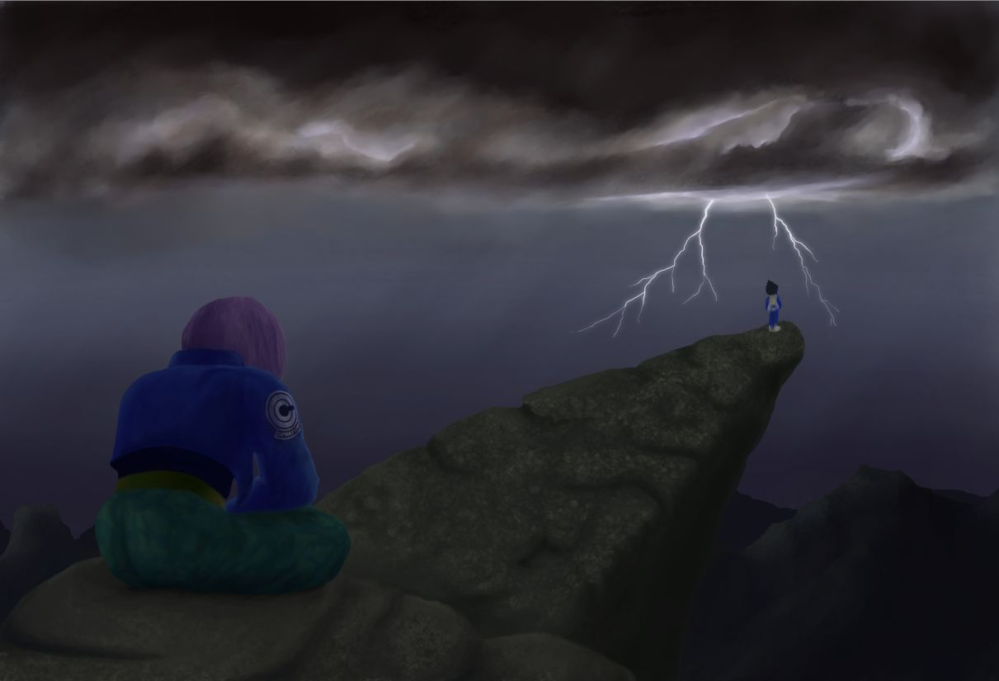

This article contains my thought process behind this painting. Characters belong to
<a href="https://en.wikipedia.org/wiki/Dragon_Ball_Z" target="_blank">Dragon Ball Z</a> universe and painting is done in
<a href="https://krita.org/en/" target="_blank">Krita</a>.

## Final painting

<a href="https://rahulsrma26.deviantart.com/art/24-Pride-And-Patience-748779649" target="_blank">Deviantart link</a>.

---

This painting is inspired from

This scene is from one of my favorite saga (android saga) from the show Dragon Ball Z. This is where Vegeta and other Z warriors lose to androids and they just find out that there is an even more powerful villain (cell). Vegeta just goes to the mountains and Trunks follows. Later, Goku arrives and Trunks informs Goku that Vegeta is standing there from the last three days. It's a sunny day with a clear sky in the show, which in my opinion doesn't suit the mood. So, to bring justice to the scene, I've altered the weather and time.

---

## Step I - Sketch

I start most of my paintings with a sketch. It gives me an idea regarding size, proportion, perspective, and the space around characters.
This process is easier to perform but a lot of thought process and tinkering is required.

Brushes:

---

## Step II - Abstract

The Next step is to make a simple painting in order to finalize my composition and overall concept. Also, I chose some base colors and base lighting, to convey the story in a better form.

At this stage, I mainly focused on shape and proportions as they will be difficult to amend later. After this stage, the painting is in good shape.

Brushes:

    

        
    

    

    
    

    

    
    

---

## Step III - Foreground

Apart from the background, the majority of the area is occupied by the rocks around the characters. I mainly focused on the shades so that extrusions of the rocks become more prominent. Also, added some shadows to Trunks.

Brushes:

    

    

---

## Step IV - Background

Now, I worked on the background. Reshaped the distant mountains. Reshade the clouds, so that they become gloomy and dark. Added a glow to the lightning so that it will be highlighted.

Brushes:

    

    

    

    

---

## Step V - Trunks

Reshaded Trunks to better mix it with the environment. Also, painted the iconic Capsule Corp logo on the jacket. Rescaled Vegeta according to perspective and distance.

Brushes:

    

    

    

    

    

    

---

## Step VI - Rain

Added rain via G'MIC-Qt based on the angle that'll suit the scene. To give an apt look at heavy rain, I've increased the brightness of distant objects and backgrounds. Vegeta's pose is changed to his iconic hands fold standing position.

---

## Step VII - Highlights

Corrected Trunks head (being too wide). Specular highlights added to show the effect of wet rocks, shining in the thunder. Added the effect of rain trickling down from rocks.

Now raindrop splashes after hitting Trunks and rocks. Slight brightness and contrast adjusted.

Brushes:

    

    

    

