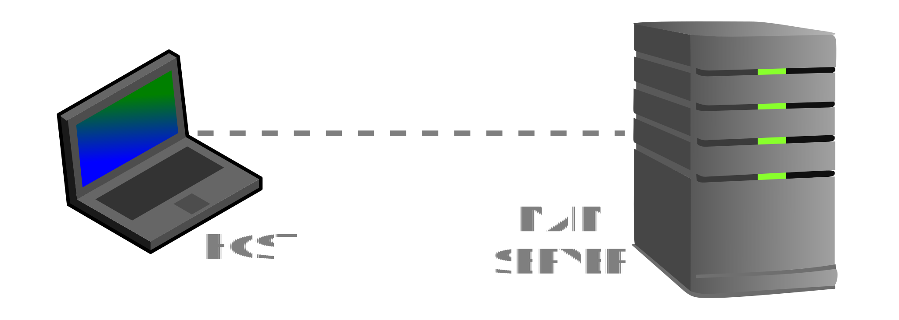

We can use SSH keys to log in to a remote machine instead of a password. SSH keys provide a more secure way of logging into a server than using a password alone. A password can eventually be cracked with a brute force attack, SSH keys are nearly impossible to decipher by brute force alone.

SSH keys come in a pair: a public and a private key. You can place the public key on any server, and then unlock it by connecting to it with a client that already has the private key. When the two matches up, the system unlocks without the need for a password. 

In this scenario, we are trying to connect to a server machine using our laptop (called the host).



## Checking

First, we need to check whether the host already has a generated ssh key or not.

```
ls ~/.ssh/id_rsa*
```

If you see these two files `id_rsa` and `id_rsa.pub`. Then it may have been generated before.


## Generating

If you don't have these files or `.ssh` directory in your home then you need to generate a key first.

```
ssh-keygen -t rsa
```

You can increase security even more by protecting the private key with a passphrase.

Now, if you have left things to default, it will generate these two files in `~/.ssh`:

* Private key (id_rsa)
* Public key (id_rsa.pub)

## Authorizing

Now to get authorized using keys we need to copy the content of our Public key to the server.
Let's assume our server ip is `192.168.0.123` and the username is `user`.

We can use the cat command with pipe to copy the contents of our public key to the server.

```
cat ~/.ssh/id_rsa.pub | ssh user@192.168.0.123 "cat >> ~/.ssh/authorized_keys"
```

Once you entered the password for one more time, you can now log in to the server without a password.

```
ssh user@192.168.0.123
```

## Managing multiple servers

Managing multiple remote servers requires a very good memory to remember connection options like usernames, remote addresses, ports, and further details. So you may need to document all the details for each server.

The SSH config file can simplify SSH connections. Create or edit `~/.ssh/config` file and add

```
Host web
    HostName 192.168.0.123
    User user
```

Now you can just directly connect using the alias.

```
ssh web
```

You can also specify port if a ssh connection requires it.

```
Host web
    HostName 192.168.0.123
    User user

Host db
    HostName 192.168.0.124
    User user
    Port 2222
```

## Jump server

A jump host (also known as a jump server) is an intermediary host or an SSH gateway to a remote network, through which a connection can be made to another host in a dissimilar security zone, for example, a demilitarized zone (DMZ). It bridges two dissimilar security zones and offers controlled access between them.

A classic scenario is connecting from your laptop to a server in your company’s internal network, which is highly secured with firewalls to a DMZ. You may access it via a jump host.


Usually you can ssh it directly

```
ssh -J jumpuser@jumpserver:port username@server:port	
```

We can specify a jump server as a proxy

```
Host alias
	User username
	HostName server
	ProxyCommand ssh -W %h:%p jumpuser@jumpserver:port
```

You can find more information about the config file <a href="https://www.ssh.com/ssh/config/" target="_blank">here</a>.