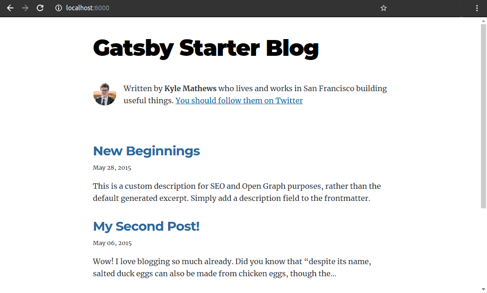

## History

I have created my first website in 2011 using vanilla HTML and CSS. Then I wanted to have a blog on my site as well. Around 2014, I ported my site to [Wintersmith](http://wintersmith.io/). It was great for the time and it supports markdown for blog writing. But, I was using a pug template engine with coffee-script in the mix, which proves difficult to use and modify for me. Also, Wintersmith's was not in active development. I wanted to have full control of my template engine using javascript only. As I have a decent understanding of [React](https://reactjs.org/), I was looking for a static site generator that is React based. Then I found [Gatsby](https://www.gatsbyjs.com/) which was open-source and based on React. It also has a very active development community and a plethora of plugins.

---

## Why static site?

A good practice is don't go for a dynamic website unless need to. Some of the advantages are:

1. Speed

    Since, we are just hosting and serving static files, when the user visits a page, all the web server has to do is to return a file. No server-side code is executed. With good caching policies and using CDNs, nothing can match the serving speed of a static site.

2. Security

    As there’s no server-side processing (back-end/database) involved, the threat of code injection is minimal for a static website.

3. Reliability

    It's very unlikely that something can go wrong in Serving just basic HTML files. However, in the case of a dynamic site, it may crash or goes down because of a server/database error.

4. Hosting

    Usually, it's cheaper to host static websites. [GitHub Pages](https://pages.github.com/), [Firebase](https://firebase.google.com/), [Fast.io](https://fast.io/), [Netlify](https://www.netlify.com/), [Amazon S3](https://docs.aws.amazon.com/AmazonS3/latest/dev/WebsiteHosting.html) are some of the popular choices.

5. Scalability

    Handling massive traffic on a dynamic website might not be as easy, as it requires complex code running on the server. Host a static website on a Cloud provider with auto-scaling and we are good to go. You can also use a Content Delivery Network (CDN) to geographically cache your static files and the calls to your web server will be drastically reduced. Also, no  database scaling will be required.

---

## Using Gatsby

To use gatsby you will first need [node and npm](https://nodejs.org/en/). After that Gatsby can be installed using npm.

```bash
npm install -g gatsby-cli
```

The above command will install Gatsby CLI globally on your machine. It is used to perform common functionality, such as creating a Gatsby application based on a starter, spinning up a hot-reloading local development server, and more!

Now, you can use gatsby-cli to create a new react starter site for gatsby. There are plenty of starter/boilerplate projects available on the [gatsby-starter](https://www.gatsbyjs.com/starters/) section. We are using a simple blog boilerplate code.

```bash
gatsby new my-blog https://github.com/gatsbyjs/gatsby-starter-blog
cd my-blog
```

This will create a new project dir. The code structure is very similar to the react app.

```
.
├── content
│   ├── assets
│   └── blog
├── gatsby-browser.js
├── gatsby-config.js
├── gatsby-node.js
├── node_modules
│   └── ...
├── package.json
├── README.md
├── src
│   ├── components
│   ├── normalize.css
│   ├── pages
│   ├── style.css
│   └── templates
└── static
    ├── favicon.ico
    └── robots.txt
```


You can now start a development server. All the changes in the code will be reflected on the server in realtime.

```bash
gasby develop
```

You can visit [http://localhost:8000/](http://localhost:8000/) to check your development server.



To deploy the site you first need to build the static pages using the build command.

```bash
gatsby build
```

This will generate the static site in the `public` directory. A local server can be used to test the generated site.

```bash
gatsby serve
```

## Start blogging

The home page can be changed by editing `src/pages/index.js` file. And you can add/remove blog posts from `content/blog` directory. Gatsby is not limited to just a blog type site. You can create almost any static-site imaginable with it. Visit [gatsbyjs.com/showcase](https://www.gatsbyjs.com/showcase/) to see all the different types of sites that others have built.

This site is build using Gatsby.

Happy Coding!
