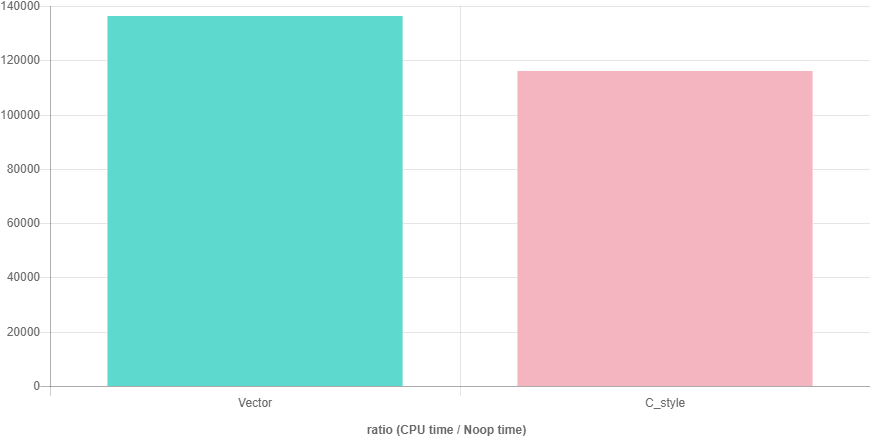
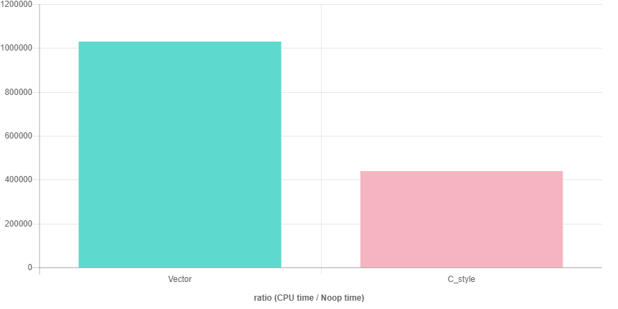
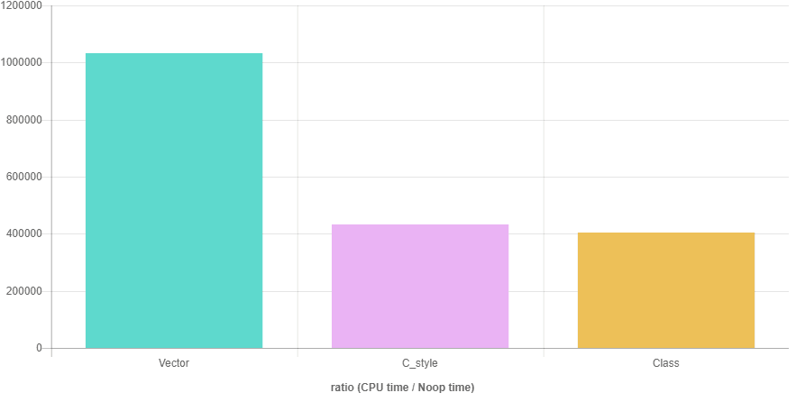

Prerequisites: moderate knowledge of C++.
<br/>
Technologies:
<a href="https://en.wikipedia.org/wiki/C%2B%2B" target="_blank">C++</i></a>
<a href="http://quick-bench.com/" target="_blank">Quick-Bench</a>

<span class="more"></span>

<script
  src="https://code.jquery.com/jquery-2.2.4.min.js"
  integrity="sha256-BbhdlvQf/xTY9gja0Dq3HiwQF8LaCRTXxZKRutelT44="
  crossorigin="anonymous">
</script>
<link href="/css/lightbox.min.css" rel="stylesheet">
<script src="/scripts/lightbox.min.js"></script>

This article shows a readable way of representing matrix without loosing performance in C++.

---

Table of content
----------------

*   [The Problem](#the-problem)
*   [Matrix Class](#matrix-class)
*   [Conclusion](#conclusion)

---

<h1 id="the-problem">The Problem</h1>

Most of people, who has to deal with the matrices in C++, would be familiar with this problem.

I'm listing two of the most popular ways for representing matrix. One excels in readability while other in performance.

* First way is to use vector of vector.
```cpp
    vector<vector<int>> matrix(rows, vector<int>(cols));
    // do stuff
    // access like matrix[y][x]
    // no need to free. RAII rocks.
```
This is similar to using double pointer in C for dynamic 2D array.
```cpp
    int **matrix = new int*[rows];
    for(int i = 0; i < rows; i++)
        matrix[i] = new int[cols];
    // do stuff
    // access like matrix[y][x]
    for(int i = 0; i < rows; i++)
        delete [] matrix[i];
    delete [] matrix;
```
It's basically an array of arrays. Every element of outer array points to another array of integers. That's why you can reference it two times. But, since every array is separately allocated, to access the array we must have to go to the elements of outer array first and then inner ones. Also, there will be no guarantee that every row will be adjacent to each other in memory. They can be scattered across the heap.

* Second way is to use C style array.
```cpp
    int* matrix = new int[rows*cols];
    // do stuff
    // access like matrix[y*cols+x]
    delete [] matrix;
```
This will make a solid continuous chunk of memory in heap. So, it'll have a better access time and pattern.


Performance
-----------

C style array access should perform better than vector style access. As, vector style has to refer two times to access an element, the address of matrix (outer array) can be saved in register but elements has to come from memory (or cache). The other problem is that, at the end of a row next row could be anywhere, and pre-fetcher can not predict next fetch.

It's hard to measure the general performance since the use case varies a lot. But to get some idea I'm considering two types of algorithm with square and rectangular matrices. All the results are compiler on GCC 7.2 with c++14 and -O3 flags on linux x86 machine.
For the simplicity sake we have fixed number of rows and columns but it can be easily changed to general inputs.

## Sum of all elements

Let us take an example of calculating the sum of all the elements in a matrix. Here are our two popular approaches:

```cpp
// Vector style code for a square matrix
// Similar thing can be achieved in C by int**
int Vector_sum(vector<vector<int>>& matrix, int N) {
    int sum = 0;
    for(int i = 0; i < N; i++)
        for(int j = 0; j < N; j++)
            sum += matrix[i][j];
    return sum;
}
```

```cpp
// C style code for a square matrix
int C_style_sum(int* matrix, int N) {
    int sum = 0;
    for(int i = 0; i < N; i++)
        for(int j = 0; j < N; j++)
            sum += matrix[i * N + j];
    return sum;
}
```

Results for a square matrix of size 512*512
<a href="sum_square_1.png" data-lightbox="sum_1" data-title="Sum of elements (512x512)">
</a>
See this benchmark on <a href="http://quick-bench.com/GXUG06sZDLCrGsOogF5wmd2DOFU" target="_blank">quick-bench</a>

Results for a rectangular matrix of size 1024*256
<a href="sum_rectangle_1.png" data-lightbox="sum_1" data-title="Sum of elements (1024x256)">
</a>
See this benchmark on <a href="http://quick-bench.com/ekNZpPxwiw4wYtqOV51vPF8CXUo" target="_blank">quick-bench</a>

As you can see the difference is not much. I can live with that for most of the programs. However, transpose yields a complete different story.


## Transpose of all elements

Let us also take an example of transposing a matrix. Which will have completely different access pattern then sum. Here are our two popular approaches:

```cpp
// Vector style code for a square matrix
// Similar thing can be achieved in C by int**
using namespace Matrix = vector<vector<int>>;
int Vector_transpose(Matrix& matrix1, Matrix& matrix2, int N) {
    int sum = 0;
    for(int i = 0; i < N; i++)
        for(int j = 0; j < N; j++)
            matrix[i][j] = matrix[j][i];
    return sum;
}
```

```cpp
// C style code for a square matrix
int C_style_transpose(int* matrix1, int* matrix2, int N) {
    int sum = 0;
    for(int i = 0; i < N; i++)
        for(int j = 0; j < N; j++)
            matrix2[i * N + j] = matrix1[j * N + i];
    return sum;
}
```

Results for a square matrix of size 512*512
<a href="transpose_square_1.png" data-lightbox="transpose_1" data-title="Transpose of elements (512x512)">
</a>
See this benchmark on <a href="http://quick-bench.com/0DVlD6PAcBQvMmfnjLlJpcSHcls" target="_blank">quick-bench</a>

Results for a rectangular matrix of size 1024*256
<a href="transpose_rectangle_1.png" data-lightbox="transpose_1" data-title="Transpose of elements (1024x256)">
</a>
See this benchmark on <a href="http://quick-bench.com/IyZq2RwP_RtZJpC4B8iwTSTSRwI" target="_blank">quick-bench</a>

---

<h1 id="matrix-class">Matrix Class</h1>

We can write a custom template class that will allow us to access elements like vector. To achieve we need to overload the brackets operator.

```cpp
// e.g. a matrix of 5 rows and 3 cols
// matrix<int, 5, 3> x;
// can be accessed like x[row][col]

template<typename T, size_t R, size_t C>
class matrix {
    T* data; // can be changed to unique_ptr in C++1z
public:
    matrix() : data(new T[R*C]) {}

    ~matrix(){ delete [] data; }

    inline T* operator[](int row) {
        return &data[row * C];
    }

    inline const T* operator[](int row) const {
        return &data[row * C];
    }
};

```

Almost all the compilers today can optimize away the referencing and dereferencing of the same array. The assembly code generated by it is virtually same as the C style version.

So, how well it performs.

## Sum of all elements

Results for a square matrix of size 512*512
<a href="sum_square_2.png" data-lightbox="sum_2" data-title="Sum of elements (512x512)">
</a>
See this benchmark on <a href="http://quick-bench.com/UODm6ylUQGqDCGbdxMIUvpqHrcA" target="_blank">quick-bench</a>

Results for a rectangular matrix of size 1024*256
<a href="sum_rectangle_2.png" data-lightbox="sum_2" data-title="Sum of elements (1024x256)">
</a>
See this benchmark on <a href="http://quick-bench.com/-rGgWT2v0CZsUNbOtoTOCs9ybiE" target="_blank">quick-bench</a>

Separate code can be found <a href="sum.cpp" target="_blank">here</a>

## Transpose of all elements

Results for a square matrix of size 512*512
<a href="transpose_square_2.png" data-lightbox="transpose_2" data-title="Transpose of elements (512x512)">
</a>
See this benchmark on <a href="http://quick-bench.com/VxtU_lR77Fjtm-vo9Vs8CmMDQl4" target="_blank">quick-bench</a>

Results for a rectangular matrix of size 1024*256
<a href="transpose_rectangle_2.png" data-lightbox="transpose_2" data-title="Transpose of elements (1024x256)">
</a>
See this benchmark on <a href="http://quick-bench.com/PXQl8uW3Dk1R_pBelXFlFCMRxEY" target="_blank">quick-bench</a>

Separate code can be found <a href="transpose.cpp" target="_blank">here</a>