This article contains my story of getting into art and drawings. Also contains most of my pencil drawings.

Jump to [drawings](#drawings)

<link href="/css/lightbox.min.css" rel="stylesheet">

Since my school-days, I always lean towards math and science. But art also kept me fascinated. I grew up with 90's cartoons like Duck-Tales, The Mask, Dexter's Lab etc. While watching those shows, I always wondered, how they are able to make those cartoons look evil or funny. Also, one of my uncle is an artist. Whenever he visited our home, I requested him to draw celebrities' faces (usually Bollywood actor/actress). His drawings looked real. And he does that with whatever basic pencil/colors I had. Sometimes, I don’t even have the full set colors. Most of the time colors were missing from the set. At that time, I understood that you don't need expensive stuff to make a good piece of art. 

In my school, I was good at drawing but not in the top bracket. So, I never took it seriously. My grandfather was a civil engineer. At that time all the home designs are hand draws so calligraphy course was a must for a civil engineer. Fast forward to 8th grade. I got a calligraphy book from him. I don’t remember the name as the cover got torn and missing. But, it was an amalgam of different types of styles old English, italics, etc. It was like some sort of cheat sheet for calligraphy. He also gifted me Speedball calligraphy nibs and pen. I got into my new profound hobby. Book also had lessons on improving handwriting by giving exercises to develop muscle memory. Before this, I was slightly above average in terms of handwriting, but after one year I’m one of the best in my class (of 60). Every class has a class chart with the name of every student along with their roll number. At that time the class chart was supposed to be made by the student with the best handwriting in the class. Head-teachers of the class often boasts about marks and handwriting of their class. Next year, I was getting requests from multiple teaches for their class chart. That gave me an unofficial acknowledgment that I was now one of the best in the entire grade (9 classes of the same size).

I choose the science stream after high-school as I cannot be separated from computer and maths. And all the hobbies are taken by large P.C.M. syllabus, programming, and PC gaming. Fast forward to college, I started again by scratching random things on my notebook while attending boring classes. My college days are not so hectic, so I started sketching again after ages.  

<h2 id="drawings"><b>The Shadow </b> (my drawing book)</h2>

> -all are done on plain A4 sheet

My college cafeteria (College of engineering Roorkee)
<a href="img/page02.jpg" data-lightbox="the-shadow" data-title="My college cafeteria (College of engineering Roorkee)">
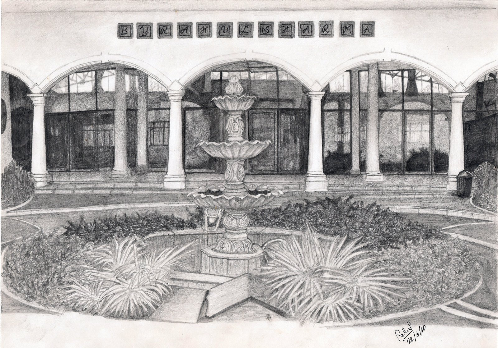</a>

Corvette

Iron-man
<a href="img/page04.jpg" data-lightbox="the-shadow" data-title="Iron-man">
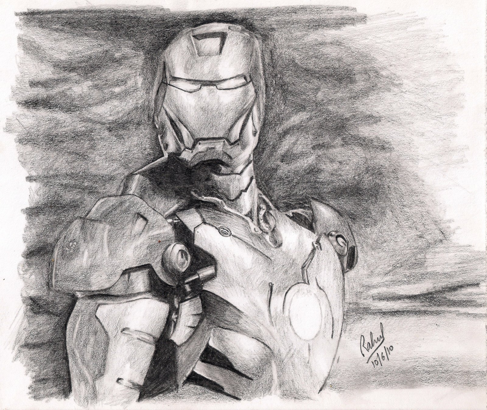</a>

Rihanna
<a href="img/page05.jpg" data-lightbox="the-shadow" data-title="Rihanna">
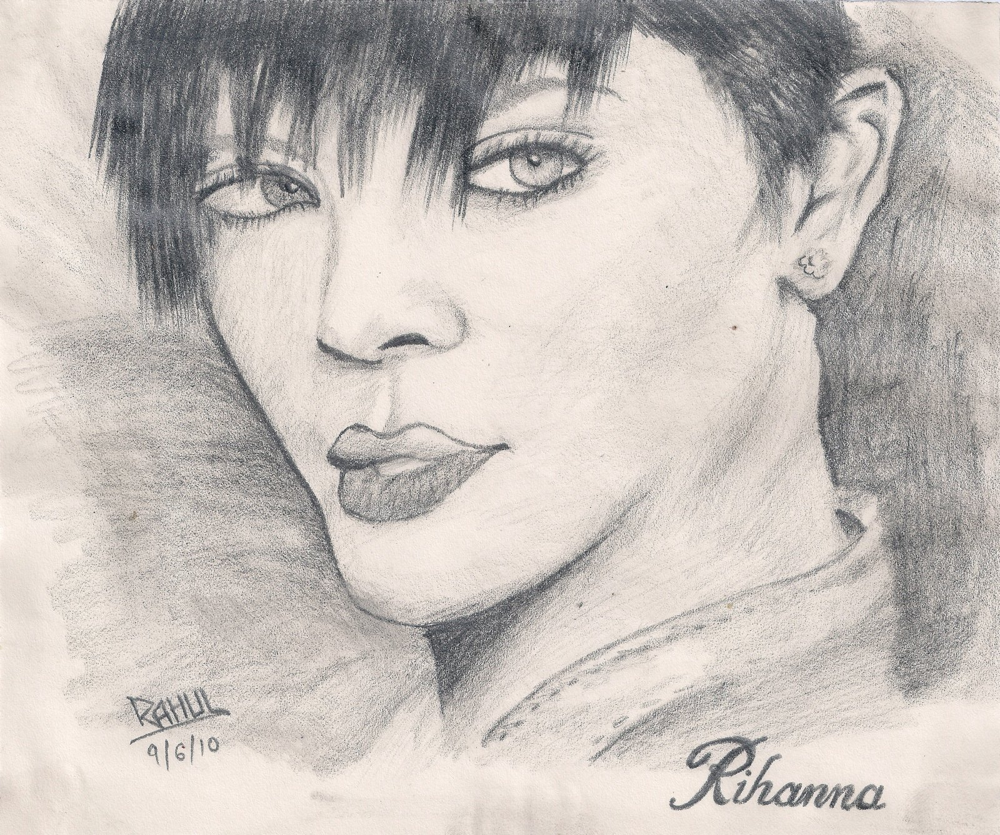</a>

Lord Krishna
<a href="img/page06.jpg" data-lightbox="the-shadow" data-title="Lord Krishna">
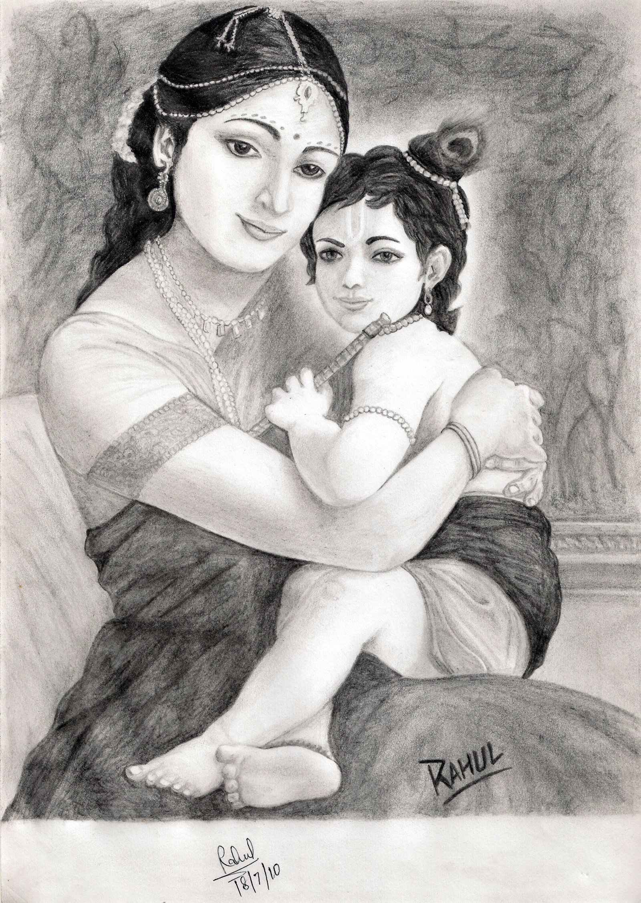</a>

Aishwarya Rai
<a href="img/page07.jpg" data-lightbox="the-shadow" data-title="Aishwarya Rai">
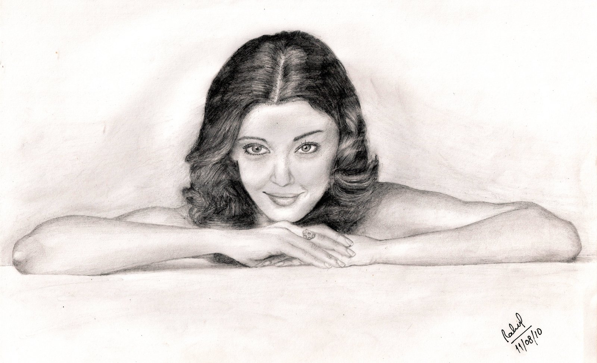</a>

Man tearing paper
<a href="img/page08.jpg" data-lightbox="the-shadow" data-title="Man tearing paper">
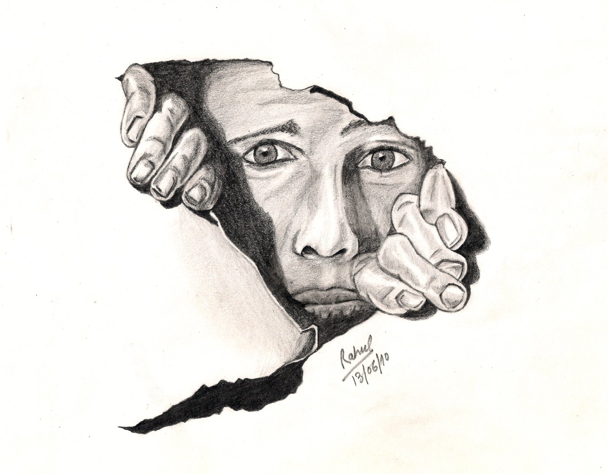</a>

Devin Star Tailes
<a href="img/page10.jpg" data-lightbox="the-shadow" data-title="Devin Star Tailes">
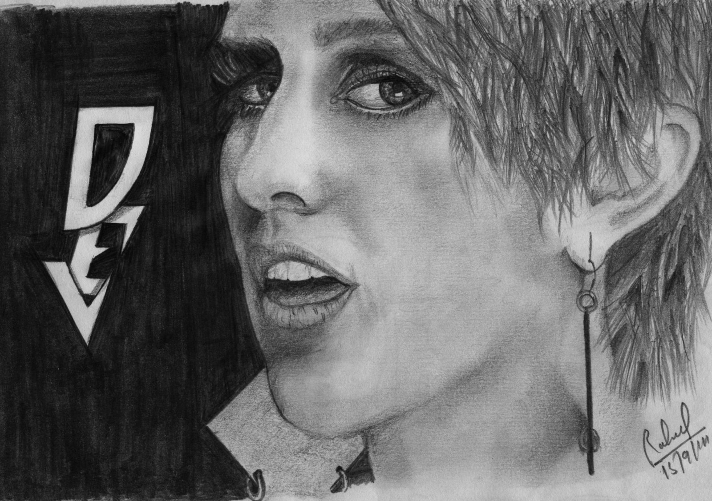</a>

Anne Hathaway
<a href="img/page11.jpg" data-lightbox="the-shadow" data-title="Anne Hathaway">
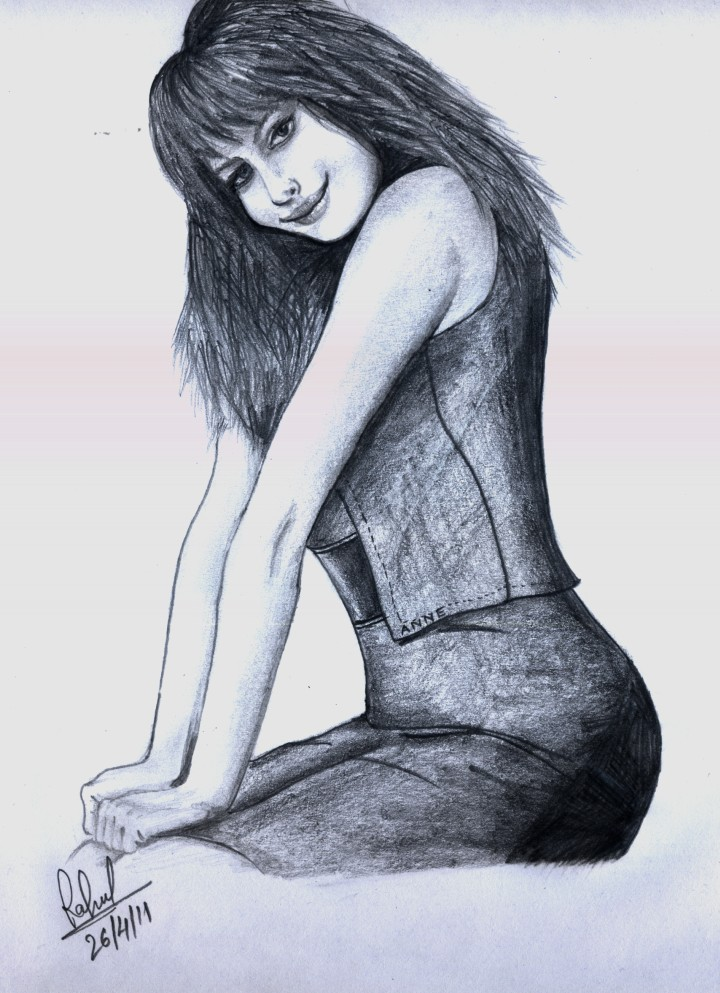</a>

Anime girl
<a href="img/page12.jpg" data-lightbox="the-shadow" data-title="Anime girl">
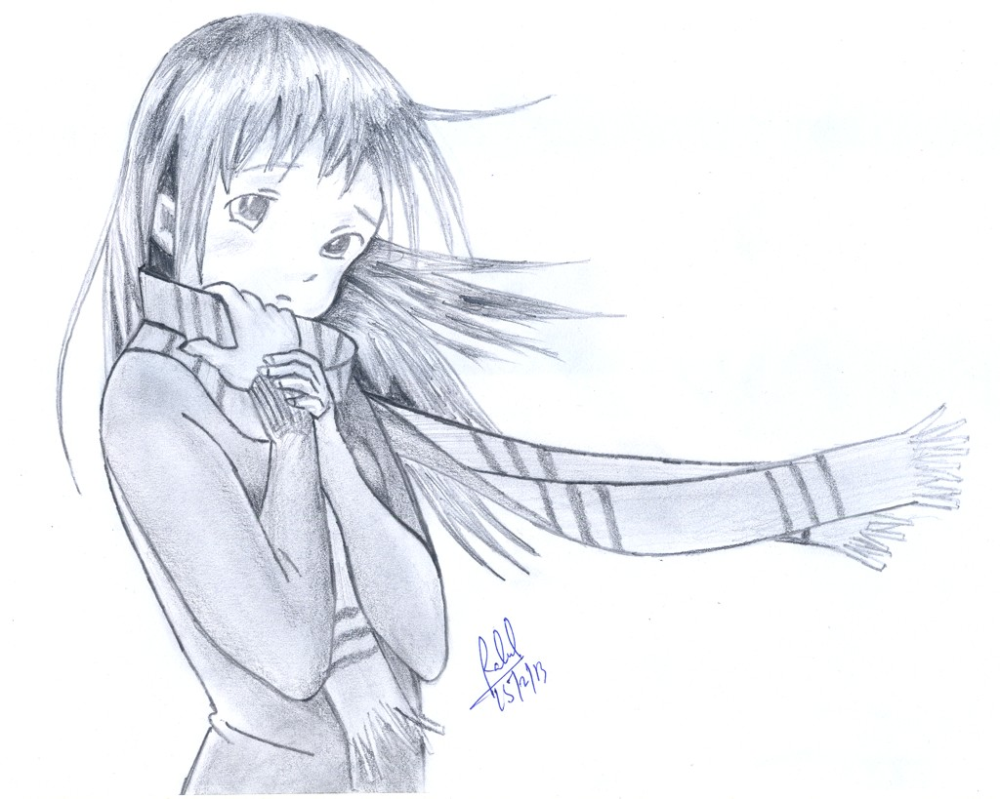</a>

Scarlett Johansson
<a href="img/page13.jpg" data-lightbox="the-shadow" data-title="Scarlett Johansson">
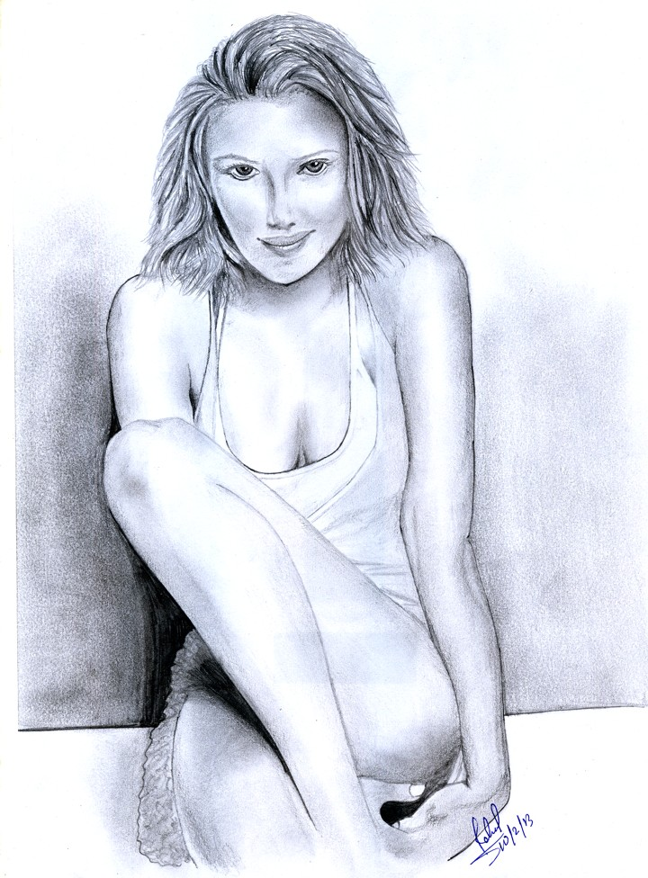</a>

Bonus (childhood prayer)

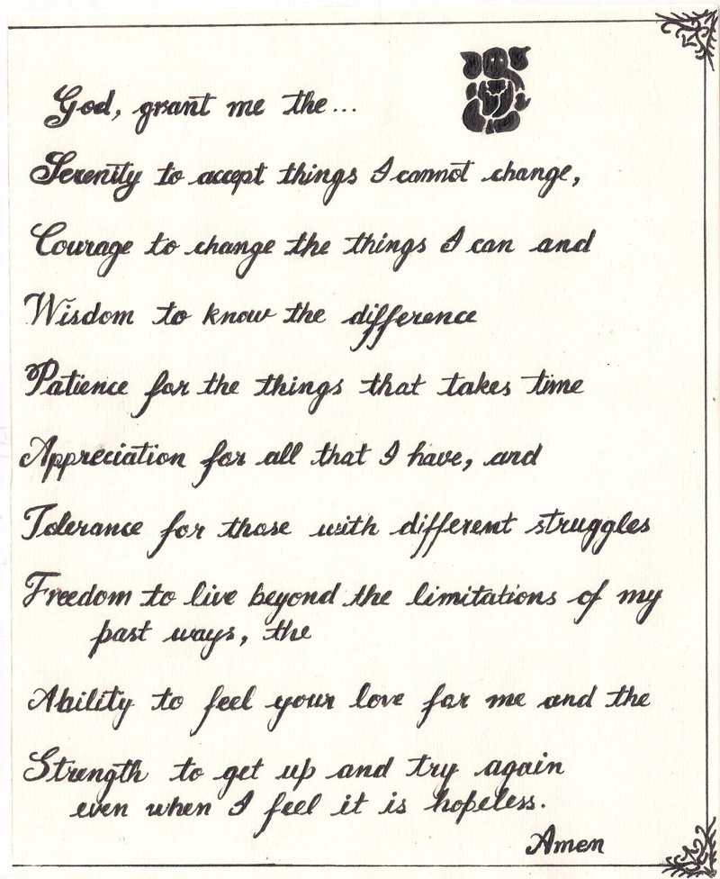
